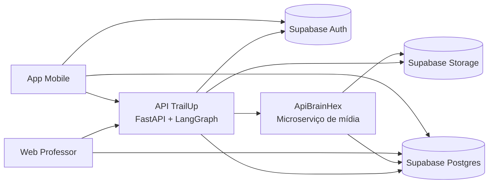
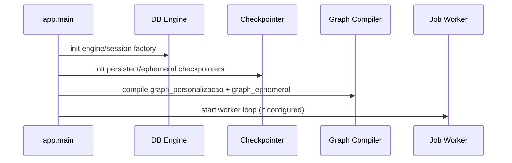
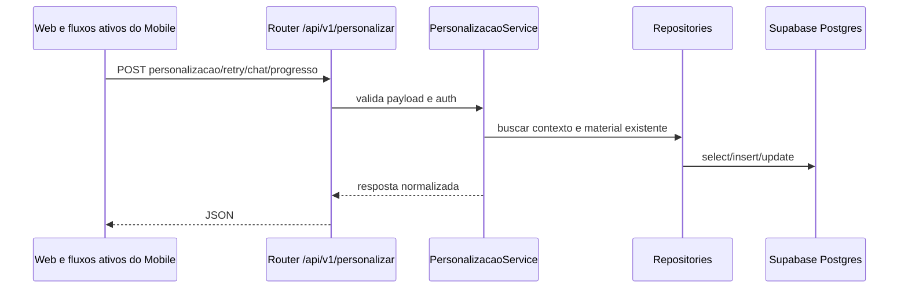
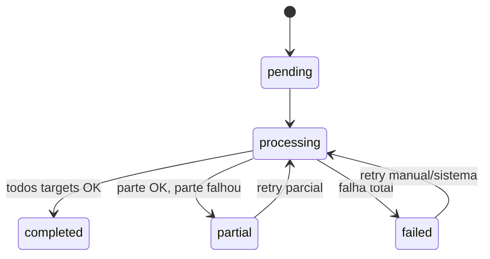

# Arquitetura do App (API TrailUp) - Versão Detalhada

## 1. Propósito deste documento
Este documento descreve a arquitetura **do app backend principal** (API TrailUp), separada da arquitetura do microserviço de mídia. O foco é explicar responsabilidades, limites, fluxos, decisões técnicas, pontos críticos de operação e evolução.

## 2. Contexto do ecossistema
A API TrailUp é o núcleo de orquestração adaptativa do sistema. Ela integra:
- Supabase (Auth, Postgres, Storage)
- App mobile (leitura no Supabase e telemetria/acoes ativas na API)
- Web do professor (operação pedagógica e disparo de jobs)
- Microserviço ApiBrainHex (geração multimídia)

## 3. Visão de containers


## 4. Responsabilidades da API TrailUp
### 4.1 Domínio pedagógico-adaptativo
- orquestrar personalização por aluno, classe, tópico e ciclo
- compor contexto de fonte + perfil + progresso
- decidir quando reaproveitar, regenerar ou ignorar material

### 4.2 Contratos HTTP
- expor endpoints estáveis para web/mobile
- manter backward compatibility de payloads quando possível

### 4.3 Execução assíncrona
- enfileirar e processar jobs de personalização
- controlar retries, partial failures e idempotência operacional

### 4.4 Telemetria
- receber lotes de sinais comportamentais
- normalizar payload para consumo analítico e retroalimentação

## 5. Estrutura de código e camadas
```text
app/
  api/                      # routers e contratos HTTP
  agent/                    # graph, state builders, prompts
  core/                     # settings e infraestrutura base
  db/                       # engine/session
  repositories/             # SQL e acesso persistente
  schemas/                  # pydantic models de entrada/saida
  services/                 # regras de negócio e orquestração
alembic/                    # migrações estruturais
docs/                       # documentação funcional
sql/                        # scripts manuais operacionais
```

### Regras de dependência
- `api` depende de `services` e `schemas`
- `services` depende de `repositories`
- `repositories` depende de `db`
- `agent` é consumido por `services`
- controllers/routers não devem conter SQL

## 6. Ciclo de vida da aplicação


## 7. Fluxo HTTP (personalização síncrona/consulta)


## 8. Fluxo assíncrono de jobs
### 8.1 Modelo operacional
- tabela de jobs: `personalizacao_jobs`
- tabela de targets: `personalizacao_job_targets`
- cada target representa uma unidade perfil x tópico (com owner técnico opcional)

### 8.2 Estado dos jobs
- `pending`
- `processing`
- `completed`
- `partial`
- `failed`



## 9. Dedupe e reuso por perfil BrainHex
### 9.1 Chave de deduplicação
A deduplicação de job de mídia usa:
- `kind`
- `classe_id`
- `topico_id`
- `source_hash`
- `brainhex_profile_key`

### 9.2 Objetivo
- evitar gerar a mesma mídia N vezes para alunos diferentes com o mesmo perfil/contexto
- reduzir custo e latência

### 9.3 Reuso intra-job
- `shared_rendered_media` no snapshot do job
- primeiro target gera
- targets seguintes reaproveitam

## 10. Persistência e contratos centrais
### 10.1 Tabela canônica
- `conteudo_personalizado`

### 10.2 Campo de materiais
`materiais` guarda artefatos com status por item:
- `pending`
- `completed`
- `failed`

### 10.3 Garantias
- merge por artefato
- evitar overwrite indevido de artefato já concluído

## 11. Telemetria
### 11.1 Entrada
- `POST /api/v1/telemetria/lotes`

### 11.2 Papel
- consolidar sinais de interação
- alimentar análise comportamental
- subsidiar estratégias de personalização

### 11.3 Não objetivos
- API não calcula ranking em tempo real por endpoint
- ranking é consolidado no banco por SQL (views/triggers)

## 12. Segurança
- autenticação: JWT Supabase
- segregação de secrets por `.env`
- service role só no backend confiável
- validação de entrada por schema

## 13. Observabilidade
### Logs essenciais
- claim/release de job
- transição de estado de target
- tempo por etapa de pipeline
- falhas por artefato

### Métricas recomendadas
- taxa de sucesso por job
- taxa de sucesso por target
- tempo médio por target
- taxa de dedupe efetiva

## 14. Riscos e mitigação
- falha parcial de mídia: status por artefato + fallback
- drift de contrato: normalização e testes de integração
- backlog de jobs: limites de concorrência + retry controlado

## 15. Decisões arquiteturais explícitas
1. usar dedupe por perfil BrainHex (e não por aluno)
2. manter pipeline multimídia desacoplado em microserviço
3. manter ranking consolidado no banco
4. preservar contrato estável para clientes

## 16. Roadmap sugerido
- idempotency key explícita por target
- tracing distribuído API <-> microserviço
- política de expiração/rotação de artefatos antigos
- painel de operação dos jobs com métricas de SLA
