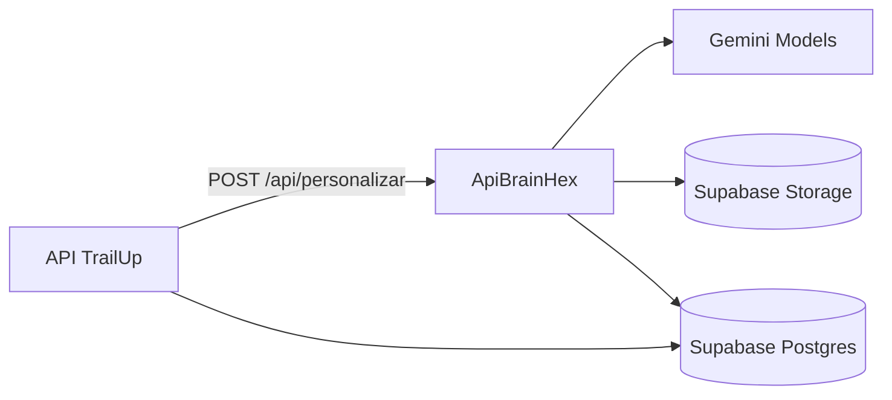
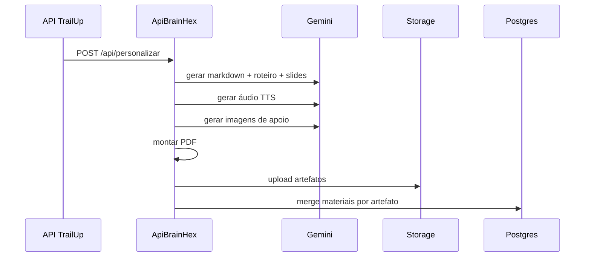

# Arquitetura do Microserviço (ApiBrainHex) - Integração a partir da API TrailUp

## 1. Propósito
Este documento descreve a arquitetura do microserviço de mídia **separadamente** da arquitetura da API principal, com foco em contrato, integração, execução e governança operacional.

## 2. Papel do microserviço no ecossistema
O ApiBrainHex é responsável por geração multimodal por perfil BrainHex:
- markdown
- áudio (TTS)
- apresentação (PDF/slides)

A API TrailUp delega a geração ao microserviço e mantém o controle transacional do ciclo de personalização.

## 3. Diagrama de integração

## 4. Contrato principal
### Entrada (resumo)
- `profile`
- `personalizacao_id`
- `classe_id`
- `topico_id`
- `ciclo_id`
- `conteudo_estudado`

### Saída imediata
- `202 processing`

### Efeito colateral esperado
- atualização de `conteudo_personalizado.materiais`
- URLs dos artefatos no Storage

## 5. Pipeline interno do microserviço

## 6. Isolamento de responsabilidade
### API TrailUp
- decide quando chamar
- controla dedupe/job
- mantém estado de personalização

### ApiBrainHex
- executa geração multimídia
- publica artefatos
- sinaliza status por artefato

## 7. Reuso por perfil e storage prefix
A estratégia vigente privilegia reuso por perfil/contexto:
- prefixo `brainhex/{perfil}/classe-{id}/topico-{id}`
- objetivo: reaproveitamento físico de mídia entre alunos compatíveis

## 8. Falhas e comportamento esperado
### Falha parcial
- um artefato pode falhar sem invalidar todos os demais
- status deve refletir granularidade por item

### Falha total
- manter erro rastreável
- permitir retry sem corromper artefato já `completed`

## 9. Segurança operacional
- `SUPABASE_SERVICE_ROLE_KEY` somente backend
- validação estrita de perfil e payload
- proteção contra overwrite indevido em merge

## 10. Observabilidade mínima recomendada
- contagem de requests por endpoint
- latência de cada etapa do pipeline
- taxa de falha por tipo de artefato
- tempo de recuperação por retry

## 11. Decisões de arquitetura
1. microserviço separado para desacoplamento de carga multimídia
2. contrato assíncrono para não bloquear UX
3. merge por artefato para robustez
4. identidade pedagógica por perfil BrainHex como eixo de geração
