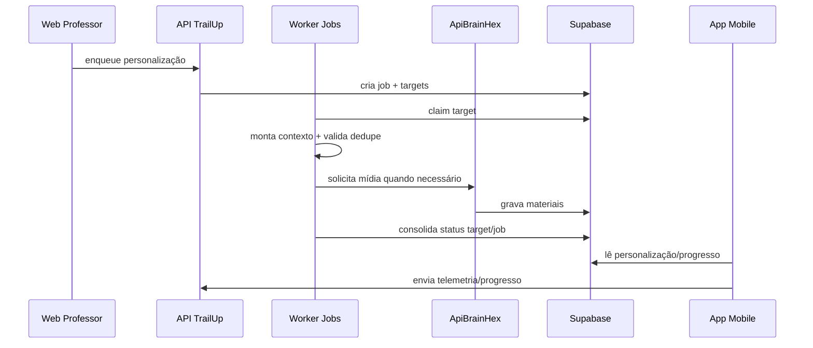

# Funcionamento Detalhado - Personalização, Gamificação e Recursos Pedagógicos (API TrailUp)

## 1. Objetivo do documento
Detalhar como o backend executa personalização e sustenta mecânicas de gamificação e recursos pedagógicos com rastreabilidade técnica e intencionalidade pedagógica.

## 2. Personalização - visão funcional

### 2.1 Entrada de contexto
- metadados acadêmicos (classe, tópico, conteúdo)
- perfil BrainHex dominante
- progresso prévio do aluno
- hash de fonte (`source_hash`)

### 2.2 Decisão de execução
- verificar se já existe material compatível
- decidir entre reutilizar, pular ou regenerar
- enfileirar job/target conforme necessidade

### 2.3 Geração e persistência
- pipeline de texto/estrutura
- pipeline de mídia (delegado ao microserviço)
- persistência em `conteudo_personalizado`
- registro de status por artefato

## 3. Motivos pedagógicos da personalização
- adequação de linguagem ao perfil cognitivo/comportamental
- aumento de relevância e familiaridade narrativa
- reforço multimodal para reduzir esquecimento

## 4. Objetivos pedagógicos mensuráveis
- aumentar taxa de conclusão de tópico
- aumentar acurácia em atividade
- reduzir abandono em conteúdos longos
- melhorar consistência de estudo

## 5. Gamificação - papel do backend

### 5.1 Componentes
- eventos (`eventos_aluno`)
- progresso consolidado (`classe_aluno` e correlatas)
- ranking (view SQL)
- conquistas/notificações (quando aplicável)

### 5.2 Regra de separação de responsabilidades
- API fornece e recebe dados de comportamento/progresso
- cálculo final de ranking é consolidado no banco por SQL

### 5.3 Motivos
- garantir consistência de cálculo em fonte única
- evitar divergência entre clientes

### 5.4 Objetivos
- feedback competitivo saudável
- visibilidade de evolução real
- estímulo de constância

## 6. Recursos pedagógicos aplicados

### 6.1 Recursos atualmente suportados no ecossistema
- markdown estruturado
- cards
- atividades avaliativas
- áudio narrado
- apresentação visual

### 6.2 Critérios de aplicação
- alinhamento com objetivo do tópico
- aderência ao perfil BrainHex
- disponibilidade técnica e fallback do cliente

### 6.3 Motivos
- cobrir canais verbal, visual e prático
- reduzir barreira de entrada em temas complexos

### 6.4 Objetivos
- ampliar retenção de conteúdo
- melhorar transferência para resolução de problema

## 7. Fluxo ponta a ponta (detalhado)

## 8. Guardrails técnicos
- dedupe por perfil + fonte
- retry com backoff
- status granular por artefato
- idempotência por alvo lógico

## 9. Guardrails pedagógicos
- não bloquear estudo por falha parcial de mídia
- manter fallback acadêmico base
- preservar coerência de conteúdo com fonte

## 10. Indicadores de operação e aprendizagem
### Operacionais
- p95 de geração por target
- taxa de job `completed` vs `partial`
- taxa de dedupe efetivo

### Pedagógicos
- tempo ativo por tópico
- conclusão por tópico
- acertos por atividade
- evolução de ranking por ciclo

## 11. Antipadrões a evitar
- regenerar mídia sem mudança de `source_hash`
- cálculo de ranking em múltiplos clientes
- dependência de um único formato de recurso

## 12. Evolução sugerida
- score de qualidade pedagógica por artefato
- painéis de observabilidade por perfil BrainHex
- experimento A/B de estratégia de recurso por tipo de tópico
