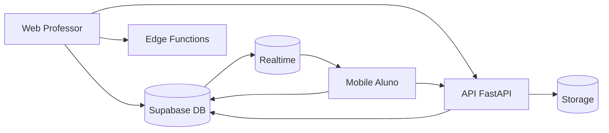
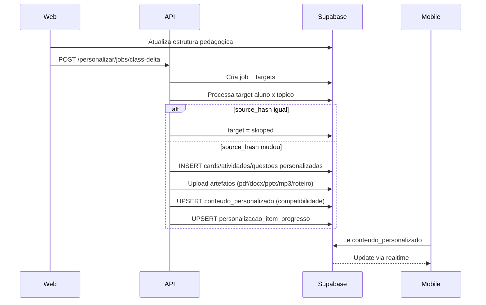
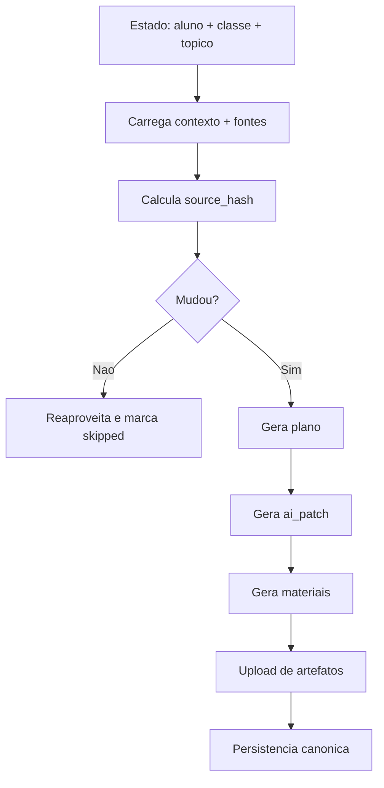
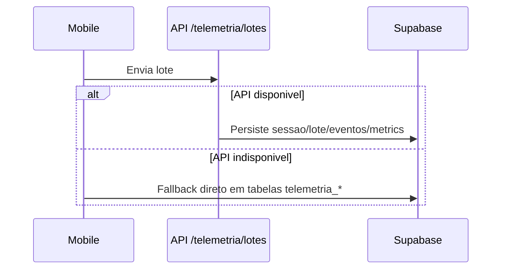

# TrailUp - Fluxo Completo (Apresentação)

Atualizado em: 2026-04-13

## 1) Arquitetura ponta a ponta

## 2) Fluxo de personalização por aluno

## 3) Pipeline de geração do personalizado

## 4) Telemetria (normal e fallback)

## Notas executivas

- Personalização e pre-gerada por job assíncrono (não em tempo de abertura da tela).
- Reprocessamento e evitado quando `source_hash` não muda.
- Mobile consome estado canônico do banco e atualiza via realtime.
- `questoes.nota_estabelecida` e opcional (`NULL` = sem nota definida).

## Atualizacoes (2026-04-13)

- Console do professor passou a validar upload com lista fixa de formatos (pdf, doc, docx, ppt, pptx, txt, md, mp3, wav, ogg, mp4, webm, mov) e limite de 200 MB.
- Midia de questoes aceita apenas image/video/audio/pdf.
- Web envia `personalizacaoThemeGuide` (paleta + tom por perfil) para a Edge Function `generate-content-ai`.
- Edge Function inclui um guia de tema e tom no prompt de IA, alinhando a geracao com o tema do mobile.
