# Fluxo Completo do Ecossistema TrailUp

Atualizado em: 2026-04-13

## Indice
- [1. Objetivo](#sec-01)
- [2. Arquitetura de alto nivel](#sec-02)
- [3. Fluxo principal de personalização por aluno](#sec-03)
- [4. Fluxos de job por tipo](#sec-04)
- [5. Pipeline interno de geração personalizada](#sec-05)
- [6. Tipos de material personalizado](#sec-06)
- [7. Persist?ncia canônica da personalização](#sec-07)
- [8. Progresso personalizado por item](#sec-08)
- [9. Telemetria e analítica](#sec-09)
- [10. Estados de processamento](#sec-10)
- [11. Regra de nota opcional em questões](#sec-11)
- [12. Artefatos de plataforma (SQL e Edge)](#sec-12)
- [13. Tabela de rastreabilidade rapida](#sec-13)
- [14. Referencias de codigo](#sec-14)

## 1. Objetivo

Este documento explica o fluxo completo do TrailUp, do ponto de vista operacional:
- Web do professor
- API FastAPI
- Supabase (DB, Storage, Realtime)
- App Mobile do aluno
- Edge Functions

Também detalha:
- quando a personalização por aluno e gerada
- quando ela e reaproveitada por `source_hash`
- como o mobile consome e persiste progresso
- como a telemetria entra no pipeline

### 1.1 Atualizacoes recentes (2026-04-13)

- Pipeline multimidia fast-first em producao:
  - fase inicial: `cards` e `quiz`;
  - fase assincrona: `pdf`, `documento`, `apresentacao`, `audio`, `video`.
- `video` passa a ser artefato `mp4` minimo (n?o mais roteiro markdown).
- `conteudo_personalizado.materiais` reflete status por midia em metadata.
- Falha de fonte n?o interrompe entrega rapida: midias podem ficar `pending` ou `failed`.
- Trigger de classe para `class_theme_sync` enfileira jobs automaticos de mapa tematico.

## 2. Arquitetura de alto nivel

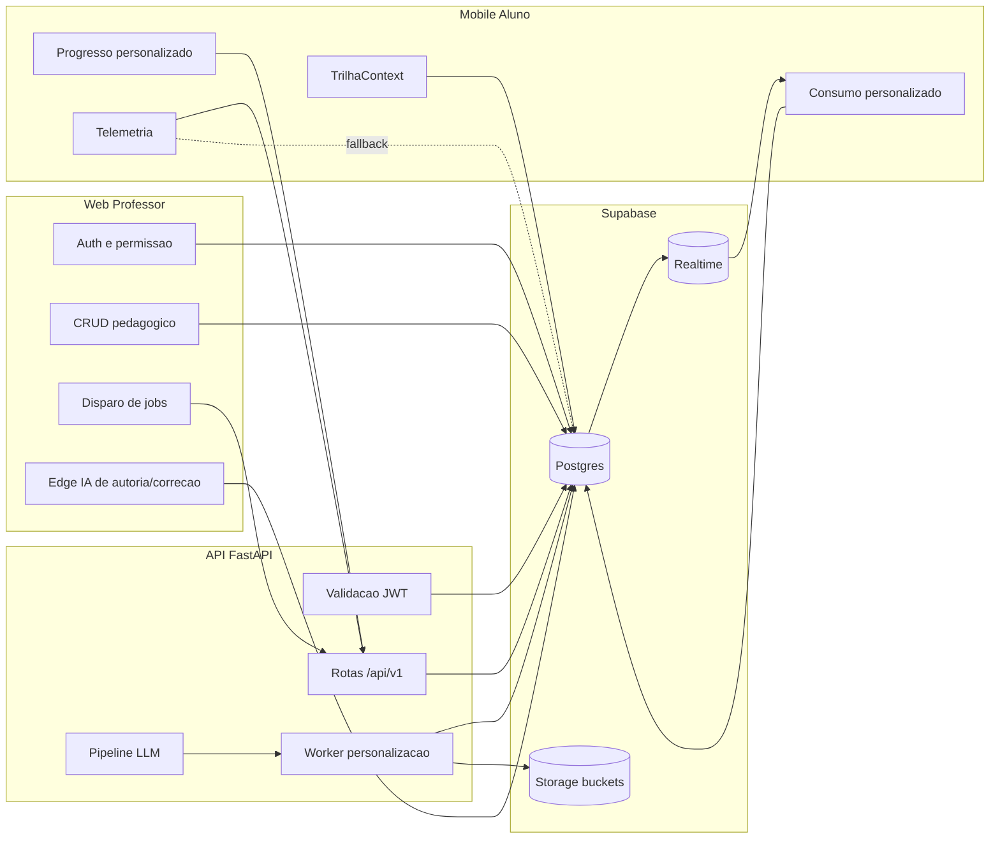

## 3. Fluxo principal de personalização por aluno

### 3.1 Professor altera estrutura e dispara job

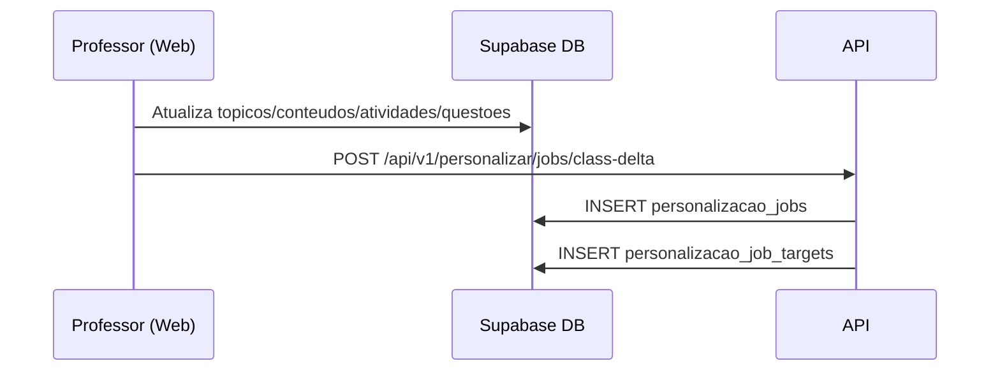

### 3.2 Worker processa cada target (aluno x tópico)

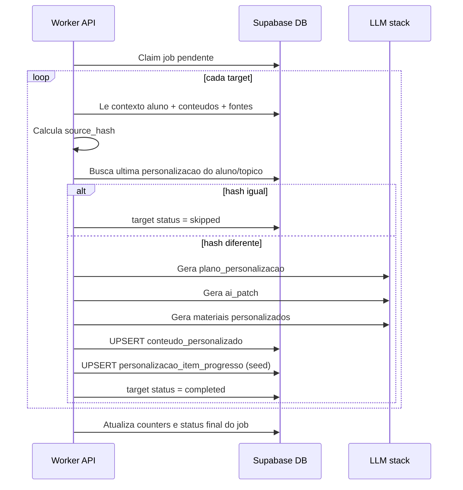

### 3.3 Mobile consome personalização persistida

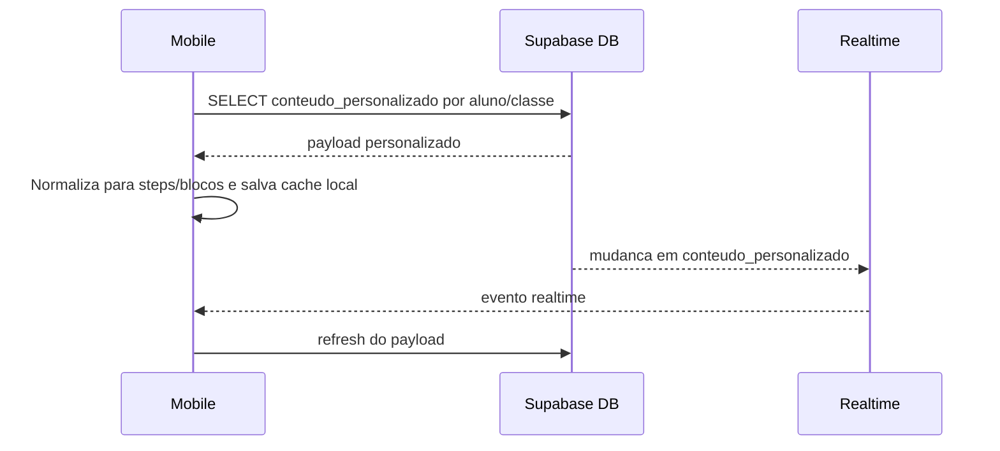

## 4. Fluxos de job por tipo

### 4.1 Enrollment (nova matricula)

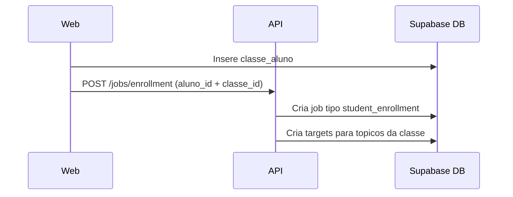

### 4.2 Class delta (mudanca de conteúdo)

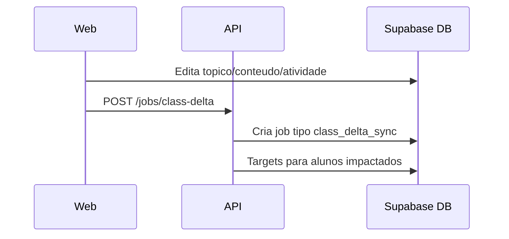

### 4.3 Student cleanup (remocao do aluno)

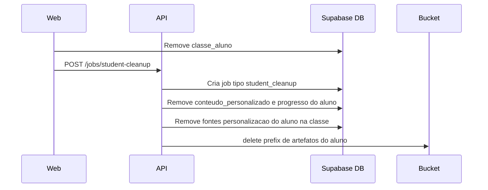

## 5. Pipeline interno de geração personalizada

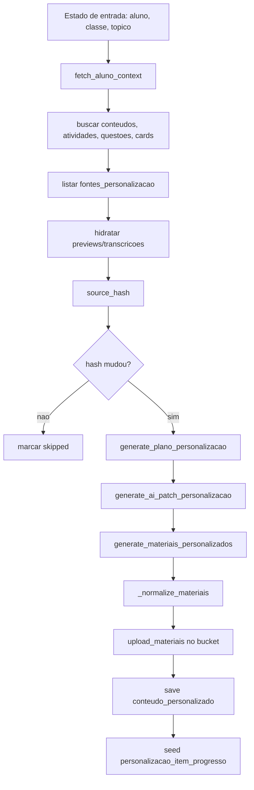

## 6. Tipos de material personalizado

Tipos suportados no motor:
- `pdf`
- `cards`
- `quiz`
- `video`
- `audio`
- `documento`
- `apresentacao`
- `imagem`

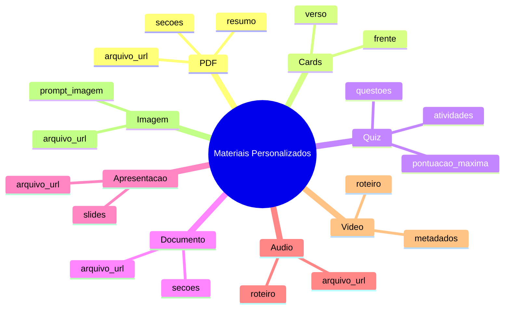

## 7. Persist?ncia canônica da personalização

Tabela central: `conteudo_personalizado`

Campos mais importantes:
- `aluno_id`
- `classe_id`
- `topico_id`
- `conteudo_id`
- `ciclo_id`
- `plano`
- `materiais`
- `ai_patch`
- `status`
- `source_hash`
- `formato_prioritario`
- `formatos_gerados`

Regra estrutural importante:
- indice unico por `(aluno_id, topico_id)` para estratégia de upsert.

## 8. Progresso personalizado por item

Tabela: `personalizacao_item_progresso`

`item_kind` esperado:
- `content`
- `activity`
- `cards`

Fluxo:
1. Worker semeia registros iniciais apos gerar personalização.
2. Mobile envia progresso via API `/api/v1/personalizar/progresso`.
3. API valida ownership da personalização e faz upsert do item.

## 9. Telemetria e analítica

### 9.1 Ingestao de telemetria

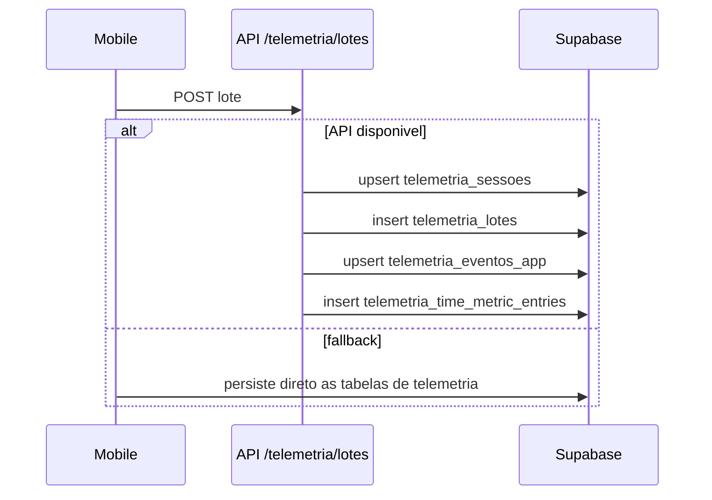

### 9.2 Views para análise

Principais views:
- `vw_metricas_sessoes_aluno_dia`
- `vw_metricas_engajamento_aluno_classe`
- `vw_metricas_desempenho_aluno_classe`
- `vw_metricas_comportamento_aluno_classe`
- `vw_metricas_chat_aluno_classe`
- `vw_metricas_evolucao_desempenho_aluno_dia`
- `vw_telemetria_tempo_topico_aluno`
- `vw_telemetria_tempo_conteudo_aluno`
- `vw_telemetria_tempo_atividade_aluno`

## 10. Estados de processamento

### 10.1 Job agregado

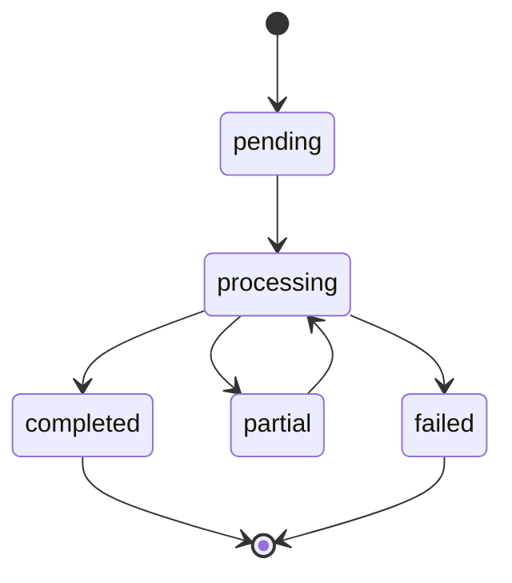

### 10.2 Target individual

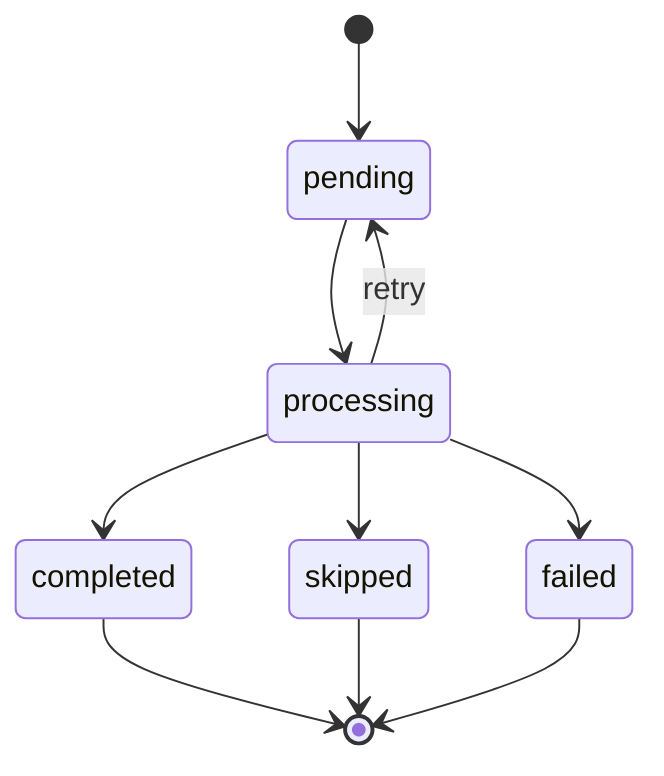

## 11. Regra de nota opcional em questões

Campo: `public.questoes.nota_estabelecida`

Semântica atual:
- opcional (`NULL` permitido)
- sem `DEFAULT`
- `NULL` = sem nota definida

Impacto no fluxo de correção dissertativa:
- se nota enviada e valida, IA corrige na escala informada
- se nota ausente/invalida, IA corrige em escala padrão 100

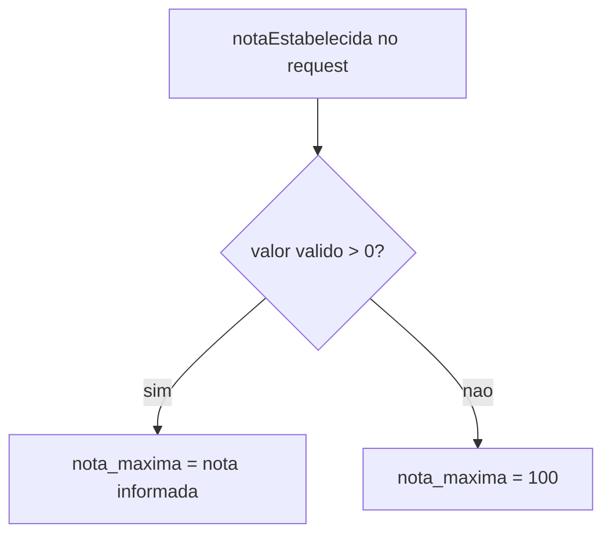

## 12. Artefatos de plataforma (SQL e Edge)

### 12.1 Edge Functions usadas
- `generate-content-ai` (Web)
- `validate-essay-answer-ai` (Web)
- `personalize_path` (Mobile)

### 12.2 RPCs usadas no app
- `fn_auth_email_exists`
- `fn_cadastrar_aluno_com_perfis`
- `inscrever_aluno_em_classe`
- `fn_atualizar_aluno_perfil`
- `fn_enviar_contato_sendgrid`

### 12.3 Trigger-functions de automacao relevantes
- `trg_classe_aluno_after_insert`
- `trg_topicos_after_insert`
- `trg_conteudos_after_insert`
- `trg_atividades_after_insert`
- `trg_limpar_dados_aluno_classe`
- `trg_eventos_aluno_after_ins`

## 13. Tabela de rastreabilidade rapida

| Etapa | Endpoint/acao | Tabelas tocadas |
|---|---|---|
| Mudanca pedagógica | CRUD Web | `topicos`, `conteudos`, `atividades`, `questoes`, etc |
| Disparo de personalização | `POST /api/v1/personalizar/jobs/*` | `personalizacao_jobs`, `personalizacao_job_targets` |
| Geração por target | Worker | `conteudo_personalizado`, `personalizacao_item_progresso` |
| Consumo no aluno | SELECT mobile + realtime | `conteudo_personalizado`, `personalizacao_jobs` |
| Progresso personalizado | `POST /api/v1/personalizar/progresso` | `personalizacao_item_progresso` |
| Telemetria | `POST /api/v1/telemetria/lotes` | tabelas `telemetria_*` |

## 14. Referencias de codigo

Web:
- `src/components/console/trilha/personalizacaoJobsApi.ts`
- `supabase/functions/generate-content-ai/index.ts`
- `supabase/functions/validate-essay-answer-ai/index.ts`

API:
- `app/api/v1/personalizacao.py`
- `app/services/personalizacao_jobs.py`
- `app/services/personalizacao.py`
- `app/repositories/personalizacao_jobs.py`

Mobile:
- `src/context/TrilhaContext.tsx`
- `src/services/personalizacaoApi.ts`
- `src/services/telemetriaApi.ts`

## Atualizacoes (2026-04-13)

- Console do professor passou a validar upload com lista fixa de formatos (pdf, doc, docx, ppt, pptx, txt, md, mp3, wav, ogg, mp4, webm, mov) e limite de 200 MB.
- Midia de questoes aceita apenas image/video/audio/pdf.
- Web envia `personalizacaoThemeGuide` (paleta + tom por perfil) para a Edge Function `generate-content-ai`.
- Edge Function inclui um guia de tema e tom no prompt de IA, alinhando a geracao com o tema do mobile.
