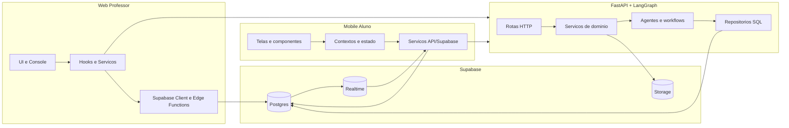
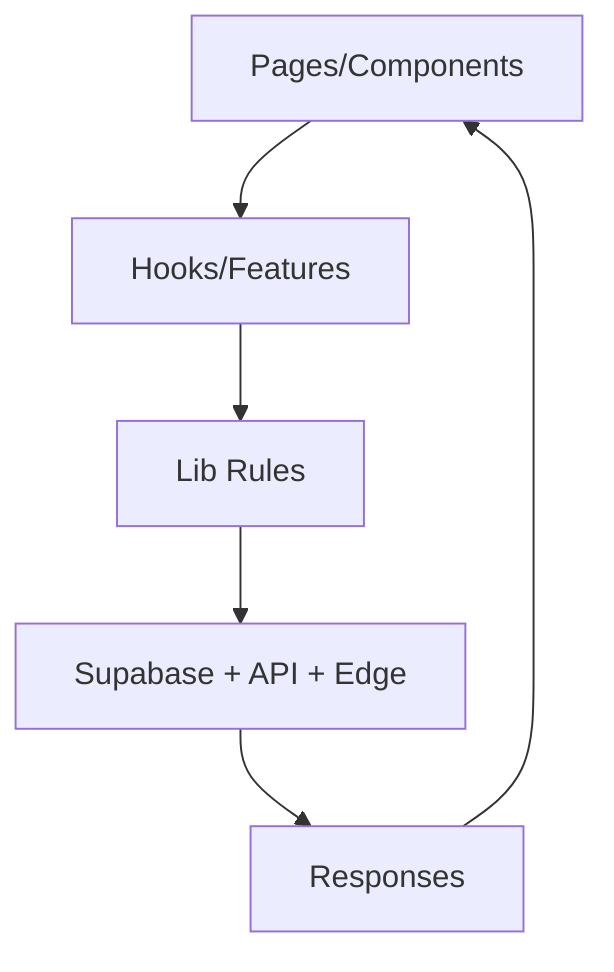
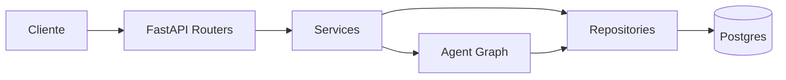
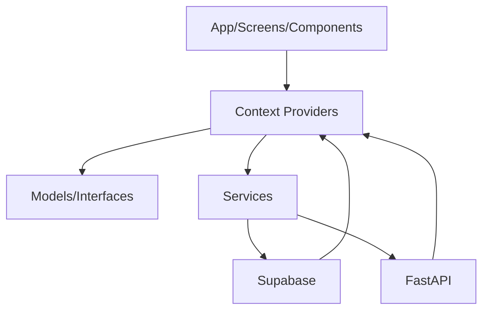
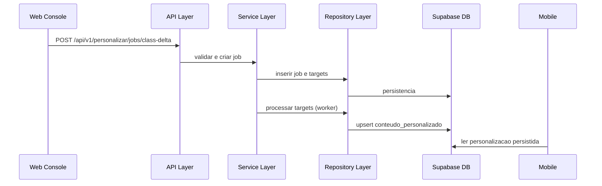
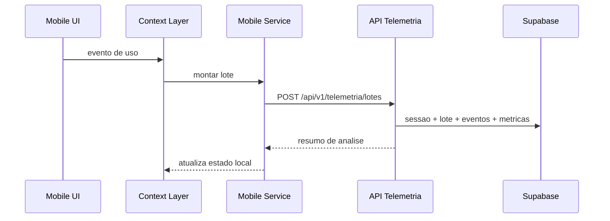

# Arquitetura e Estrutura do App: Camadas e Responsabilidades

Atualizado em: 2026-04-13

## 1. Objetivo

Este documento explica a arquitetura do ecossistema TrailUp (Web, API e Mobile), a divisao em camadas e a responsabilidade de cada camada.

## 2. Visão macro do ecossistema

## 3. Camadas por repositório

## 3.1 Web (brainhex-navigator)

Estrutura principal:
- `src/pages`: roteamento e páginas
- `src/components`: UI e módulos de tela
- `src/hooks`: auth e hooks de aplicação
- `src/features`: fluxos de neg?cio do frontend
- `src/lib`: regras, normalizadores e utilitários
- `src/integrations/supabase`: cliente e tipos
- `supabase/functions/*`: edge functions da Web

### Camadas e responsabilidades (Web)

| Camada | Diretorios | Responsabilidade |
|---|---|---|
| Presentation | `src/pages`, `src/components` | render, interação e fluxo visual do professor |
| Application | `src/hooks`, `src/features` | orquestracao de casos de uso da tela |
| Domain/UI Rules | `src/lib` | regras de validação/normalização e contratos locais |
| Infrastructure | `src/integrations/supabase`, `supabase/functions` | acesso a banco/edge function e IO externo |

## 3.2 API (ApiTraiUp)

Estrutura principal:
- `app/api`: interface HTTP FastAPI
- `app/services`: regras de neg?cio e orquestracao
- `app/agent`: grafo LangGraph e nodes
- `app/repositories`: acesso a dados (SQL)
- `app/schemas`: contratos pydantic
- `app/db`, `app/core`: sessao, engine e settings

### Camadas e responsabilidades (API)

| Camada | Diretorios | Responsabilidade |
|---|---|---|
| Interface/API | `app/api`, `app/schemas` | endpoints, validação e serialização de contratos |
| Application Services | `app/services` | casos de uso (personalização, chat, telemetria, jobs) |
| Workflow/Agent | `app/agent` | decisão e execução de workflows com LangGraph |
| Data Access | `app/repositories` | queries SQL, transações e mapeamento de entidades |
| Infrastructure | `app/db`, `app/core` | conexão DB, configuração, runtime de app |

## 3.3 Mobile (trailup-app-dsm-2502)

Estrutura principal:
- `src/app`: rotas Expo Router
- `src/components`, `src/screens`: camada visual
- `src/context`: estado global e orquestracao
- `src/services`: chamadas API e Supabase
- `src/models`, `src/interfaces`: contratos e modelos
- `src/database`: cliente Supabase
- `src/utils`: adaptadores utilitários

### Camadas e responsabilidades (Mobile)

| Camada | Diretorios | Responsabilidade |
|---|---|---|
| Presentation | `src/app`, `src/screens`, `src/components` | experiência do aluno e navegação |
| State/Application | `src/context` | sessao, trilha, IA, métricas e sincronizacao |
| Domain Model | `src/models`, `src/interfaces` | tipos de neg?cio e contratos de dados |
| Infrastructure | `src/services`, `src/database`, `src/utils` | integracao externa e persist?ncia local/remota |

## 4. Fronteiras de responsabilidade

| Assunto | Web | API | Mobile |
|---|---|---|---|
| CRUD pedagógico | dono principal | consumidor indireto | leitura |
| Geração de personalização em lote | dispara jobs | dono principal (worker) | consome resultado |
| Progresso de item personalizado | suporte visual | valida e persiste | envia dados |
| Telemetria comportamental | não principal | processa e analisa | produz e envia |
| Correção dissertativa IA | chama edge function | não principal | não principal |

## 5. Principios de separação de camadas

1. Camada visual não escreve SQL nem conhece schema detalhado.
2. Regras de neg?cio ficam em services (API) e utilitários de dominio (Web/Mobile), não em componente visual.
3. Repositórios encapsulam acesso a dados e evitam SQL espalhado.
4. Contratos de entrada/saida são tipados (`schemas`, `interfaces`, `types`).
5. Integrações externas (Supabase/API/LLM/Storage) ficam na infraestrutura.

## 6. Fluxos chave entre camadas

## 6.1 Personalização assínc

## 6.2 Telemetria

## 7. Resultado esperado dessa arquitetura

- Evolução desacoplada dos 3 repositórios.
- Menor risco de regressão por isolamento de responsabilidade.
- Operação mais previsivel (jobs, retries, estados).
- Observabilidade melhor por camada (UI, API, DB, worker).

## Atualizacoes (2026-04-13)

- Console do professor passou a validar upload com lista fixa de formatos (pdf, doc, docx, ppt, pptx, txt, md, mp3, wav, ogg, mp4, webm, mov) e limite de 200 MB.
- Midia de questoes aceita apenas image/video/audio/pdf.
- Web envia `personalizacaoThemeGuide` (paleta + tom por perfil) para a Edge Function `generate-content-ai`.
- Edge Function inclui um guia de tema e tom no prompt de IA, alinhando a geracao com o tema do mobile.
