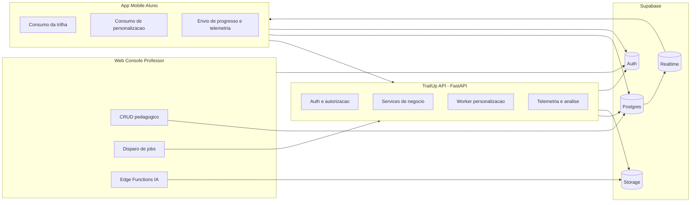
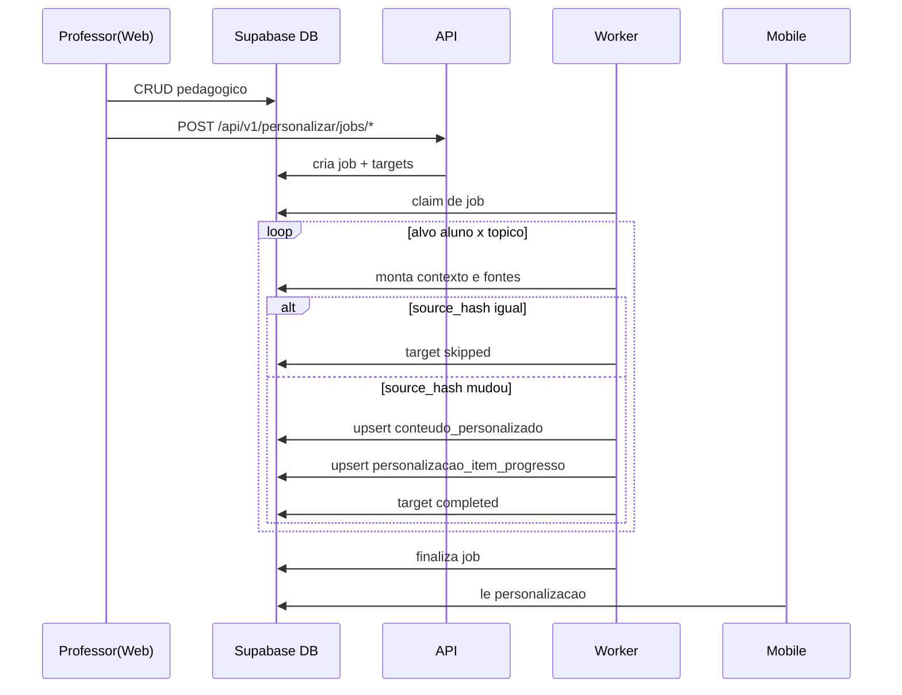
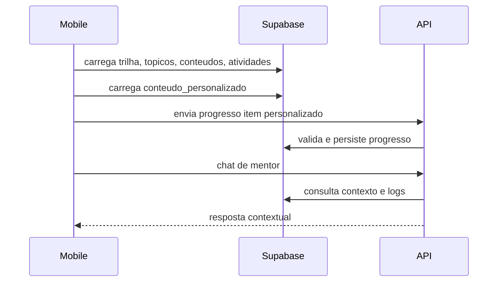
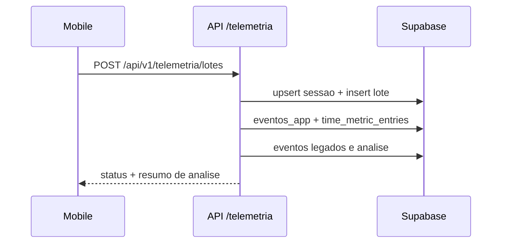
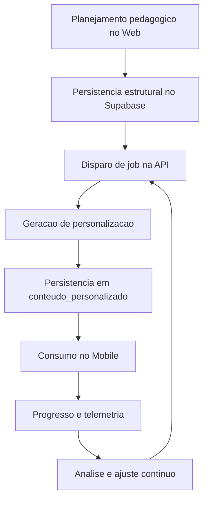

# Arquitetura e Funcionamento Geral do Sistema TrailUp

Atualizado em: 2026-04-13

## 1. Objetivo

Este documento descreve a arquitetura geral do ecossistema TrailUp e o funcionamento operacional ponta a ponta entre Web, API, Mobile e Supabase.

## 1.1 Atualizacoes recentes (2026-04-13)

- Backend de personalizacao multimidia refatorado para pipeline DAG por tipo de artefato.
- Entrega fast-first no ecossistema:
  - primeira resposta com `cards` e `quiz`;
  - midias pesadas concluidas em segundo plano.
- Geracao de video em `mp4` (MoviePy + ffmpeg) adicionada ao pipeline.
- Fluxo de classe para mapa tematico habilitado:
  - trigger em `classe` enfileira job `class_theme_sync`;
  - worker da API atualiza `classe_mapa_tema`.
- Contrato Web/Mobile mantido sem breaking change, com metadados de status por midia.

## 2. Escopo do ecossistema

Repositórios:
- Web Professor: `brainhex-navigator`
- API Backend: `ApiTraiUp`
- Mobile Aluno: `trailup-app-dsm-2502`
- Plataforma de dados: Supabase (Postgres, Storage, Realtime, Auth)

## 3. Visão de alto nivel

## 4. Arquitetura por componente

## 4.1 Web (professor)

Responsabilidades:
- autenticação e autorização do professor
- modelagem pedagógica (classe, tópicos, conteúdos, atividades, questões)
- disparo de jobs de personalização na API
- uso de edge functions para geração/avaliação com IA

Camadas:
- Presentation: páginas e componentes de console
- Application: hooks/features de fluxo docente
- Domain/UI Rules: normalizadores e validacoes
- Infrastructure: Supabase client + chamadas API/edge

## 4.2 API (backend)

Responsabilidades:
- expor contratos HTTP para Web/Mobile
- aplicar regras de acesso por role e ownership
- executar workflow de personalização por aluno/tópico
- processar telemetria e registrar análises
- manter worker assíncrono de jobs de personalização

Camadas:
- API Layer (`app/api`)
- Service Layer (`app/services`)
- Agent Layer (`app/agent`)
- Repository Layer (`app/repositories`)
- Infrastructure (`app/db`, `app/core`)

## 4.3 Mobile (aluno)

Responsabilidades:
- experiência de estudo do aluno
- leitura de trilha e conteúdo personalizado
- registro de progresso acadêmico
- envio de telemetria por lotes
- chat e interacoes de apoio via API

Camadas:
- Presentation: rotas Expo + telas/componentes
- State/Application: context providers
- Domain Model: models/interfaces
- Infrastructure: services + supabase client

## 4.4 Supabase (dados e plataforma)

Responsabilidades:
- persist?ncia principal do dominio
- armazenamento de artefatos
- realtime para propagacao de atualizações
- auth e identidade base

## 5. Fluxos operacionais principais

## 5.1 Fluxo de personalização por aluno

## 5.2 Fluxo de estudo do aluno

## 5.3 Fluxo de telemetria

## 6. Matriz de responsabilidades

| Capacidade | Web | API | Mobile | Supabase |
|---|---|---|---|---|
| CRUD pedagógico | principal | apoio | leitura | persist?ncia |
| Jobs de personalização | dispara | principal | consome | persist?ncia |
| Conteúdo personalizado | leitura docente | gera e persiste | consumo | storage+db |
| Progresso personalizado | visualizacao | valida e grava | envia | persist?ncia |
| Telemetria | não principal | processa | gera sinais | persist?ncia |
| Auth base | cliente auth | valida token | cliente auth | principal |

## 7. Ciclo de vida dos dados

## 8. Seguran?a e controle de acesso

Modelo:
- token JWT Supabase como credencial de entrada
- resolução de identidade (aluno/professor)
- validação de ownership por classe/aluno quando necessario
- rotas administrativas protegidas por basic auth

Principio:
- menor privilegio por endpoint
- professor so acessa alunos/classes permitidos
- aluno so manipula dados do próprio contexto

## 9. Escalabilidade e operação

Mecanismos principais:
- fila de jobs com targets atomicos
- retries configuraveis por target
- status agregado de job (`pending`, `processing`, `completed`, `partial`, `failed`)
- checkpointers para workflows
- retention para limpeza de checkpoint

## 10. Dependências criticas

- API depende de:
  - `DATABASE_URL`
  - `SUPABASE_URL`
  - `SUPABASE_SERVICE_KEY`
  - `SUPABASE_JWT_SECRET`
  - provider LLM (`OPENAI_API_KEY` ou `GEMINI_API_KEY`)
- Web/Mobile dependem de chaves públicas e URL da API
- consistencia do schema Supabase e requisito para os tres repositórios

## 11. Conclusão operacional

O sistema foi desenhado com separação clara:
- Web governa modelagem pedagógica e orquestracao docente
- API centraliza regras de neg?cio, workflows e processamento assínc
- Mobile executa experiência de aprendizagem e coleta sinais de uso
- Supabase sustenta persist?ncia, realtime, storage e identidade

Esse desenho permite evolução independente por repositório, mantendo contrato de dados e fluxos sincronizados.

## Atualizacoes (2026-04-13)

- Console do professor passou a validar upload com lista fixa de formatos (pdf, doc, docx, ppt, pptx, txt, md, mp3, wav, ogg, mp4, webm, mov) e limite de 200 MB.
- Midia de questoes aceita apenas image/video/audio/pdf.
- Web envia `personalizacaoThemeGuide` (paleta + tom por perfil) para a Edge Function `generate-content-ai`.
- Edge Function inclui um guia de tema e tom no prompt de IA, alinhando a geracao com o tema do mobile.
