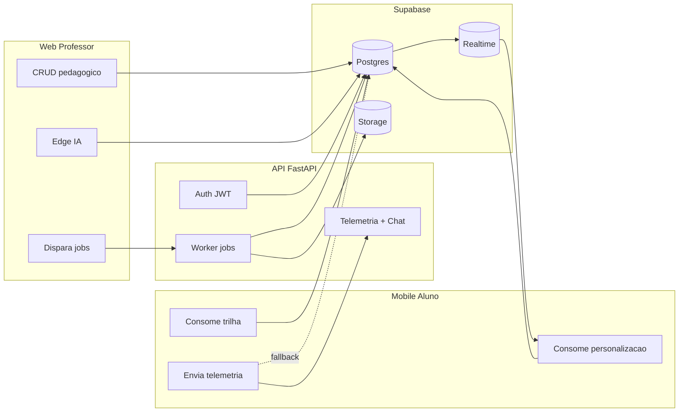
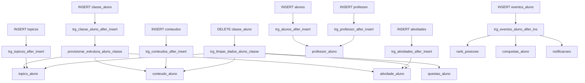
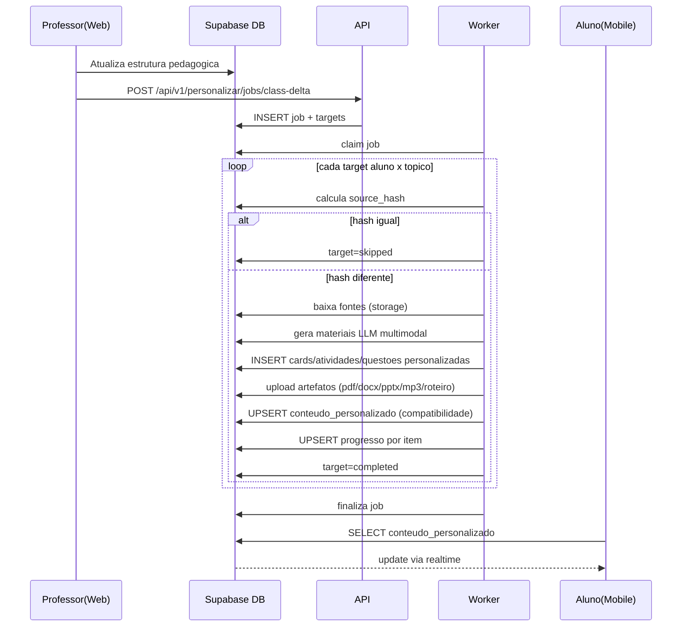
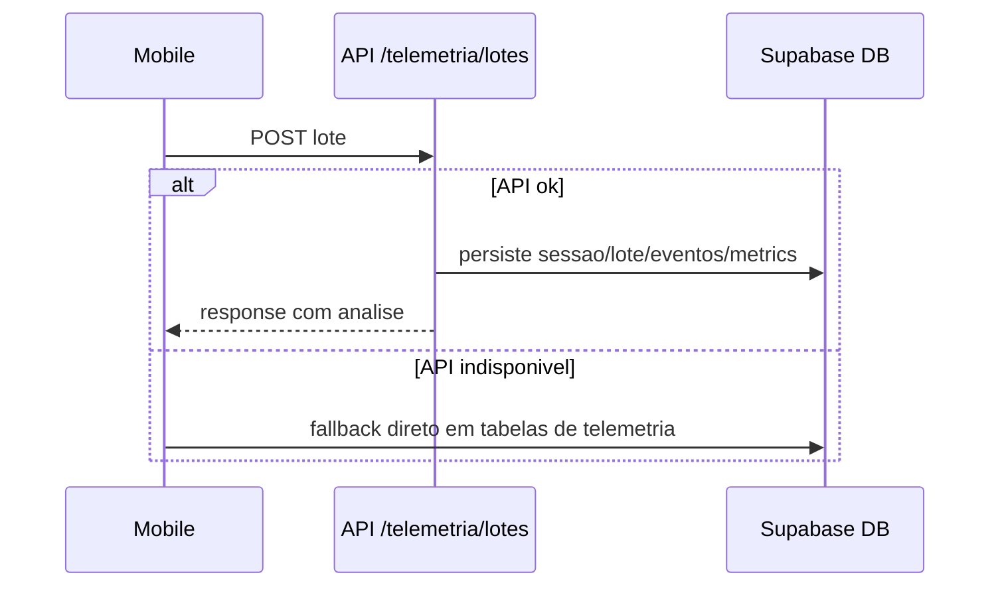
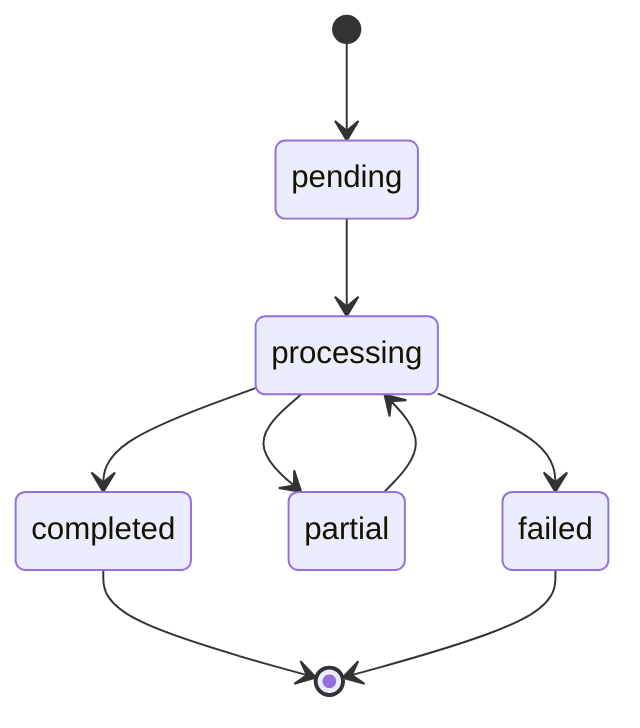
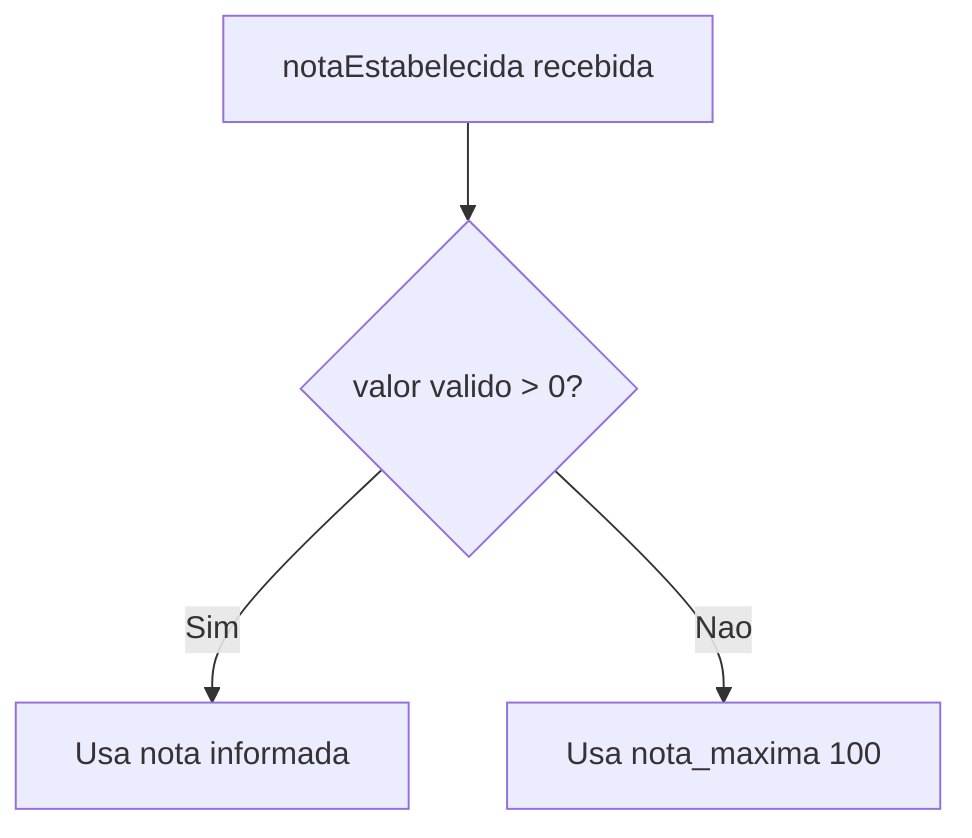

# Estrutura do Banco Supabase - Resumo Executivo

Atualizado em: 2026-04-13

## 1. Objetivo

Este resumo executivo apresenta, em formato curto, como o ecossistema TrailUp usa o Supabase em producao.

Foco:
- arquitetura fim a fim
- responsabilidades de Web/API/Mobile
- artefatos de plataforma (Edge Functions, RPCs, functions e triggers)
- fluxo de personalização por aluno
- fluxo de telemetria
- regra de `questoes.nota_estabelecida`

## 2. Arquitetura fim a fim

## 3. Quem faz o que

| Camada | Responsabilidade principal | Escrita principal no banco |
|---|---|---|
| Web | Modelagem pedagógica da turma | `classe`, `topicos`, `conteudos`, `atividades`, `questoes` |
| API | Orquestracao adaptativa | `personalizacao_jobs`, `personalizacao_job_targets`, `conteudo_personalizado`, `personalizacao_item_progresso`, `cards_personalizados`, `atividades_personalizadas`, `questoes_personalizadas`, `materiais_gerados` |
| Mobile | Consumo da trilha e progresso do aluno | `topico_aluno`, `conteudo_aluno`, `atividade_aluno`, `questao_aluno`, telemetria |
| Edge Functions | IA auxiliar do console e da trilha | sem ownership do worker de jobs |

## 4. Artefatos de plataforma (o que estava faltando)

### 4.1 Edge Functions em uso

| Edge Function | Consumidor | Papel no fluxo |
|---|---|---|
| `generate-content-ai` | Web | Gera sugestões de trilha/conteúdo/cards/atividades para autoria docente |
| `validate-essay-answer-ai` | Web | Corrige questão dissertativa com IA |
| `personalize_path` | Mobile | Retorna topologia da trilha (nodes/edges/mapTheme) |

Observação:
- `personalize_path` e chamada no mobile, mesmo sem codigo-fonte local dela neste repo Web.

### 4.2 RPCs Supabase em uso

| RPC | Consumidor | Uso |
|---|---|---|
| `fn_auth_email_exists` | Web | valida email antes de cadastro |
| `fn_cadastrar_aluno_com_perfis` | Web | onboarding de aluno + perfis BrainHex |
| `inscrever_aluno_em_classe` | Web | matricula aluno em classe |
| `fn_atualizar_aluno_perfil` | Mobile | atualiza dados/perfil do aluno |
| `fn_enviar_contato_sendgrid` | Mobile | envio de mensagem de contato/exclusao |
| `fn_trilha_by_classe` | Banco (dump) | consulta de trilha por classe/aluno |

### 4.3 SQL functions e trigger-functions identificadas

| Nome | Tipo | Efeito operacional |
|---|---|---|
| `prevent_topico_cycle` | trigger-function | bloqueia ciclo em `topico_edges` |
| `provisionar_estrutura_aluno_classe` | function | cria progresso inicial em `topico_aluno`, `conteudo_aluno`, `atividade_aluno` |
| `rls_auto_enable` | event-trigger function | habilita RLS automaticamente para novas tabelas em schema `public` |
| `set_trilha_checkpoint_navegacao_updated_at` | trigger-function | atualiza `updated_at` em checkpoint de navegação |
| `set_updated_at_timestamp` | trigger-function | padroniza `updated_at` |
| `update_updated_at_column` | trigger-function | padrão generico de `updated_at` |
| `trg_alunos_after_insert` | trigger-function | cria v?nculo inicial em `professor_aluno` |
| `trg_professor_after_insert` | trigger-function | cria v?nculo inicial professor -> alunos existentes |
| `trg_classe_aluno_after_insert` | trigger-function | dispara provisionamento da estrutura do aluno na classe |
| `trg_topicos_after_insert` | trigger-function | semeia `topico_aluno` para matriculados |
| `trg_conteudos_after_insert` | trigger-function | semeia `conteudo_aluno` para matriculados |
| `trg_atividades_after_insert` | trigger-function | semeia `atividade_aluno` para matriculados |
| `trg_limpar_dados_aluno_classe` | trigger-function | limpa progresso ao remover matricula |
| `trg_eventos_aluno_after_ins` | trigger-function | recalcula ranking e gera notificações/conquistas |

### 4.4 Mapa visual das automacoes por trigger

### 4.5 Enums e domínios relevantes

| Artefato | Valores |
|---|---|
| `modo_resposta_type` | `imediato`, `pensante` |
| `status_atividade` | `nao iniciado`, `em andamento`, `concluido` |
| `telemetria_eventos_app.event_group` | `session`, `navigation`, `interaction`, `performance`, `chat` |

## 5. Dominios de dados

| Dominio | Tabelas chave |
|---|---|
| Estrutura pedagógica | `classe`, `topicos`, `conteudos`, `atividades`, `questoes` |
| Progresso acadêmico | `topico_aluno`, `conteudo_aluno`, `atividade_aluno`, `questao_aluno` |
| Personalização | `conteudo_personalizado`, `personalizacao_jobs`, `personalizacao_job_targets`, `personalizacao_item_progresso`, `fontes_personalizacao`, `cards_personalizados`, `atividades_personalizadas`, `questoes_personalizadas`, `materiais_gerados` |
| Telemetria | `telemetria_sessoes`, `telemetria_lotes`, `telemetria_eventos_app`, `telemetria_time_metric_entries` |
| Analítica | `vw_metricas_*`, `vw_telemetria_tempo_*`, `vw_rank_posicoes_por_classe` |

## 5.1 Atualizacoes recentes (personalizacao multimidia)

- `questoes.nota_estabelecida` e opcional (NULL permitido, sem DEFAULT).
- indice parcial para upsert estavel em `conteudo_personalizado (aluno_id, topico_id)`.
- `personalizacao_job_targets` com unicidade por `(job_id, aluno_id, topico_id, conteudo_id)`.
- cards/atividades/questoes personalizados persistidos nas tabelas dedicadas.
- bucket guarda apenas artefatos (`pdf`, `docx`, `pptx`, `mp3`, `roteiro`).

## 6. Fluxo crítico: personalização por aluno

## 7. Fluxo crítico: telemetria

## 8. Estados operacionais de jobs

## 9. Regra executiva de nota por questão

Campo: `public.questoes.nota_estabelecida`

Estado atual:
- opcional de verdade
- `NULL` = sem nota definida
- sem `DEFAULT 1`

Comportamento de correção dissertativa:
- com nota definida: usa nota informada
- sem nota definida: usa escala padrão 0-100 (`nota_maxima = 100`)

## 10. Controles de integridade (resumo)

| Controle | Objetivo |
|---|---|
| `UNIQUE(job_id, aluno_id, topico_id)` em targets | evita duplicidade de processamento |
| `uq_conteudo_personalizado_aluno_topico_ativo` | 1 payload ativo por aluno/tópico |
| `uq_telemetria_eventos_app(sessao_id, client_event_id)` | dedupe de eventos mobile |
| RLS em tabelas de personalização | aluno le somente dados próprios |

## 11. Leitura complementar

Documento tecnico completo:
- `docs/estrutura-banco-supabase.md`

## Atualizacoes (2026-04-13)

- Console do professor passou a validar upload com lista fixa de formatos (pdf, doc, docx, ppt, pptx, txt, md, mp3, wav, ogg, mp4, webm, mov) e limite de 200 MB.
- Midia de questoes aceita apenas image/video/audio/pdf.
- Web envia `personalizacaoThemeGuide` (paleta + tom por perfil) para a Edge Function `generate-content-ai`.
- Edge Function inclui um guia de tema e tom no prompt de IA, alinhando a geracao com o tema do mobile.
