# Estrutura do Banco de Dados - TrailUp (Supabase)

Atualizado em: 2026-04-13

## 1. Objetivo

Este documento descreve a estrutura atual do banco Supabase do ecossistema TrailUp e como Web, API e Mobile usam esse schema em producao.

Escopo:
- catalogo de tabelas por dominio
- relacionamentos principais
- indexes, constraints e RLS relevantes
- views analiticas
- fluxos de escrita e leitura entre sistemas
- regra atual de `questoes.nota_estabelecida`

Fontes usadas:
- `C:\Users\geisb\Downloads\Banco de dados completo - TrailUp.txt`
- `C:\Users\geisb\Downloads\ApiTraiUp\sql\manual_supabase_migration.sql`
- `20260412_add_nota_estabelecida_to_questoes.sql` (migration Web)
- `20260412_make_nota_estabelecida_optional.sql` (migration Web)
- `20260413_sync_classe_mapa_tema.sql` (migration de classe -> mapa tematico)

### 1.1 Atualizacoes recentes (2026-04-13)

- Job `class_theme_sync` padronizado no backend para manter `classe_mapa_tema` sincronizada.
- Trigger SQL em `classe` enfileira job automaticamente em `personalizacao_jobs`.
- Pipeline de personalizacao multimidia fast-first:
  - persist?ncia inicial de `cards` e `quiz`;
  - midias geradas em segundo plano com status (`pending|completed|failed`) no JSON de `materiais`.
- Artefato de video atualizado para `mp4` no bucket de aluno.

## 2. Leitura rapida (mapa geral)

### 2.1 Arquitetura fim a fim

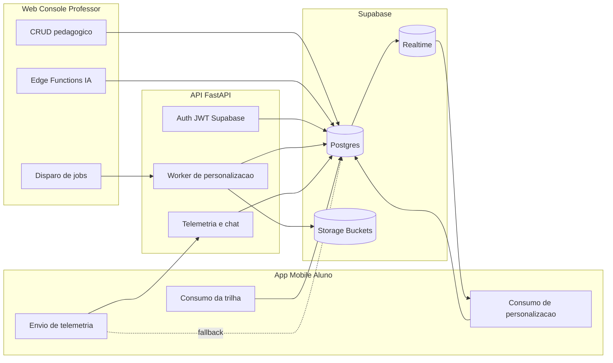

### 2.2 Distribuição de tabelas por dominio (aproximada)

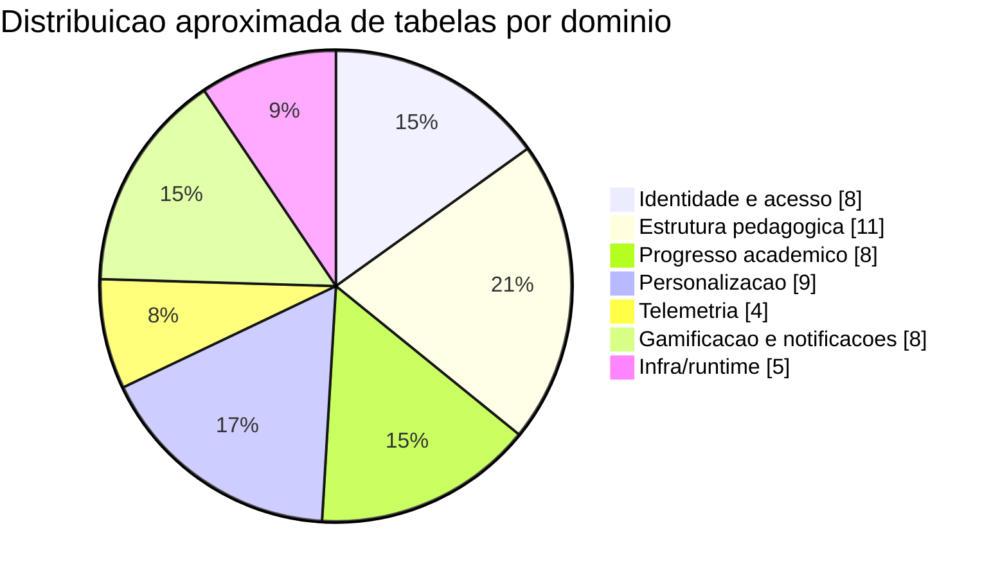

### 2.3 Matriz de responsabilidade por sistema

| Componente | Escreve em tabelas base | Escreve personalização | Escreve telemetria | Le personalização | Dispara IA |
|---|---|---|---|---|---|
| Web | Sim | Indireto (via API jobs) | Não | Parcial (contexto docente) | Sim (Edge Functions) |
| API | Não (CRUD pedagógico principal) | Sim | Sim | Sim | Sim |
| Mobile | Sim (progresso do aluno) | Sim (progresso item via API) | Sim | Sim | Não direto (usa API/edge) |
| Edge Functions | Parcial | Não | Não | Não | Sim |

## 3. Modelo por dominio (com tabelas)

### 3.1 Mapa de dominios

| Dominio | Tabelas principais | Finalidade operacional |
|---|---|---|
| Identidade e acesso | `alunos`, `professor`, `perfil`, `aluno_perfil`, `professor_aluno`, `modoOperacao`, `expo_tokens`, `solicitacoes_exclusao` | Identidade acadêmica, v?nculos e perfis |
| Estrutura pedagógica | `materia`, `classe`, `classe_aluno`, `topicos`, `topico_edges`, `conteudos`, `midias`, `cards`, `atividades`, `atividade_conteudos`, `questoes` | Grafo pedagógico da turma |
| Progresso acadêmico | `topico_aluno`, `conteudo_aluno`, `atividade_aluno`, `questao_aluno`, `trilha_checkpoint_navegacao`, `trilha_aluno`, `trilha_modelo`, `eventos_aluno` | Estado de estudo e histórico |
| Personalização | `conteudo_personalizado`, `fontes_personalizacao`, `personalizacao_jobs`, `personalizacao_job_targets`, `personalizacao_item_progresso`, `materiais_gerados`, `iaDescricao`, `ia_decision_logs`, `classe_mapa_tema` | Motor adaptativo persistido |
| Telemetria | `telemetria_sessoes`, `telemetria_lotes`, `telemetria_eventos_app`, `telemetria_time_metric_entries` | Coleta comportamental e análise |
| Gamificacao e notificações | `conquistas`, `conquistas_aluno`, `rank_tipo`, `ranks`, `rank_posicoes`, `notificacoes`, `notificacoes_agendamentos`, `notificacoes_ia`, `notificacoes_pendentes` | Engajamento e comunicação |
| Infra/runtime | `checkpoints`, `checkpoint_blobs`, `checkpoint_writes`, `checkpoint_migrations`, `alembic_version` | Persist?ncia do runtime LangGraph |

## 4. Diagramas ER (visão simplificada)

### 4.1 ER pedagógico

```mermaid
erDiagram
  MATERIA ||--o{ CLASSE : possui
  PROFESSOR ||--o{ CLASSE : ministra
  CLASSE ||--o{ TOPICOS : organiza
  TOPICOS ||--o{ CONTEUDOS : contem
  TOPICOS ||--o{ ATIVIDADES : avalia
  ATIVIDADES ||--o{ QUESTOES : gera
  ATIVIDADES ||--o{ ATIVIDADE_CONTEUDOS : vincula
  CONTEUDOS ||--o{ ATIVIDADE_CONTEUDOS : referencia
  CONTEUDOS ||--o{ MIDIAS : anexa
  CONTEUDOS ||--o{ CARDS : sintetiza
  CLASSE ||--o{ CLASSE_ALUNO : matricula
  ALUNOS ||--o{ CLASSE_ALUNO : participa
  TOPICOS ||--o{ TOPICO_EDGES : origem
  TOPICOS ||--o{ TOPICO_EDGES : destino

  QUESTOES {
    bigint id PK
    bigint atividade_id FK
    numeric nota_estabelecida NULL
  }
```

### 4.2 ER de personalização e jobs

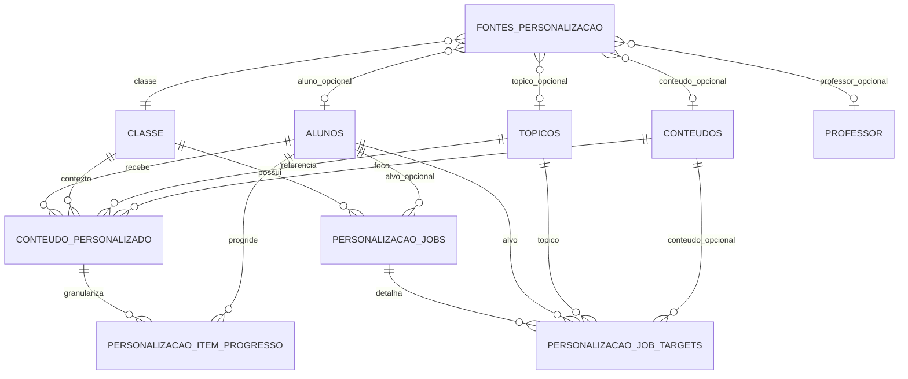

### 4.3 ER de telemetria

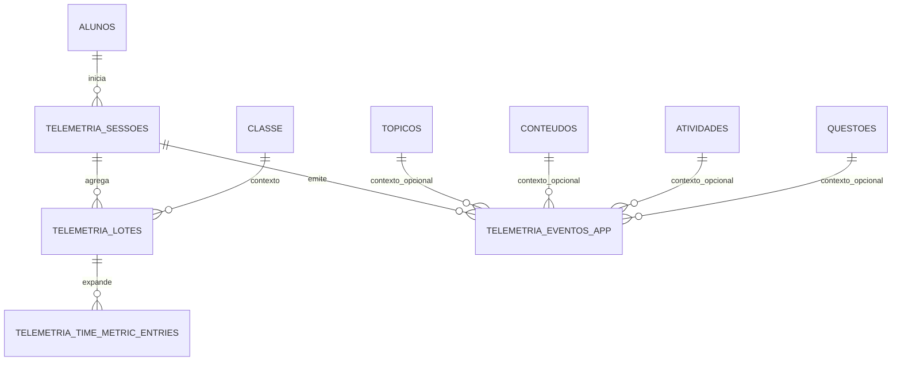

## 5. Fluxos operacionais (sequencias)

### 5.1 Fluxo de personalização por alteracao pedagógica

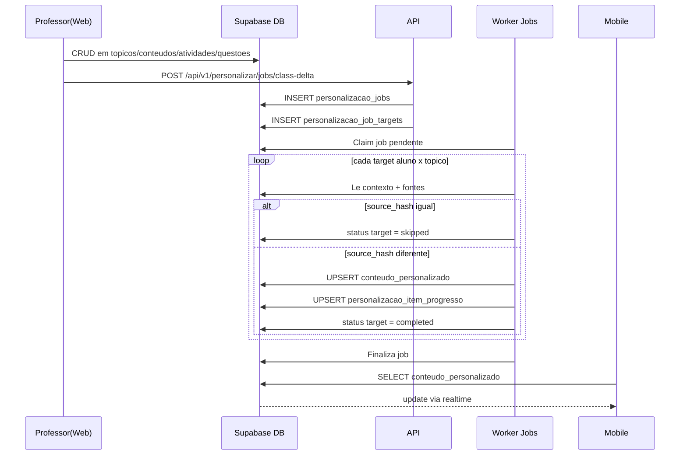

### 5.2 Fluxo de telemetria com fallback

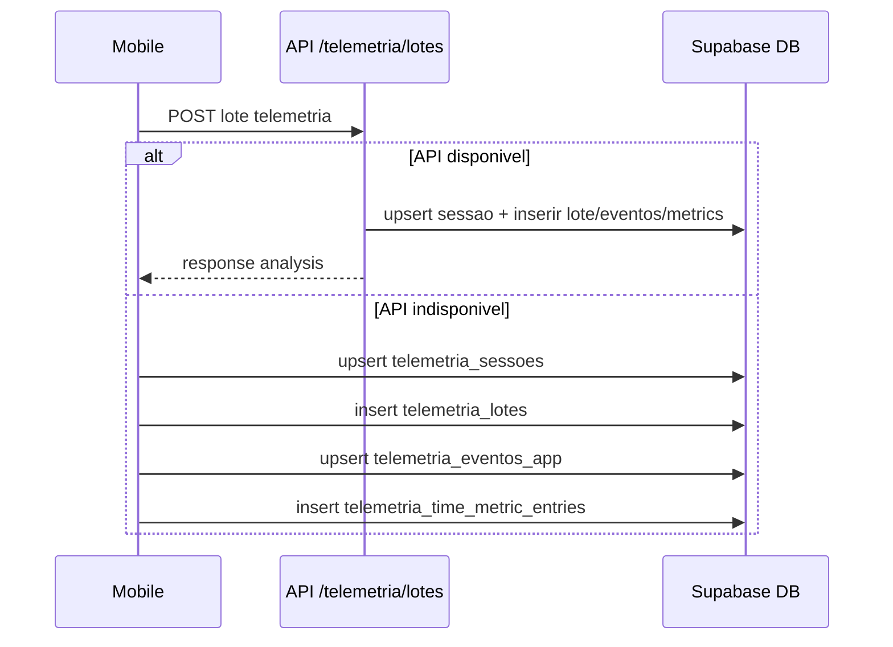

### 5.3 Fluxo de correção dissertativa com nota opcional

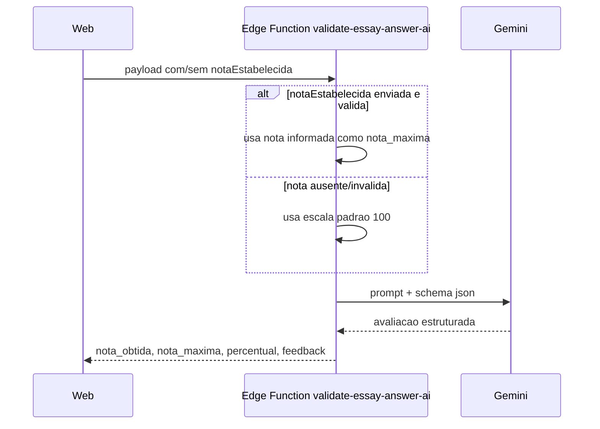

## 6. Graficos de estado

### 6.1 Estados do job agregado (`personalizacao_jobs.status`)

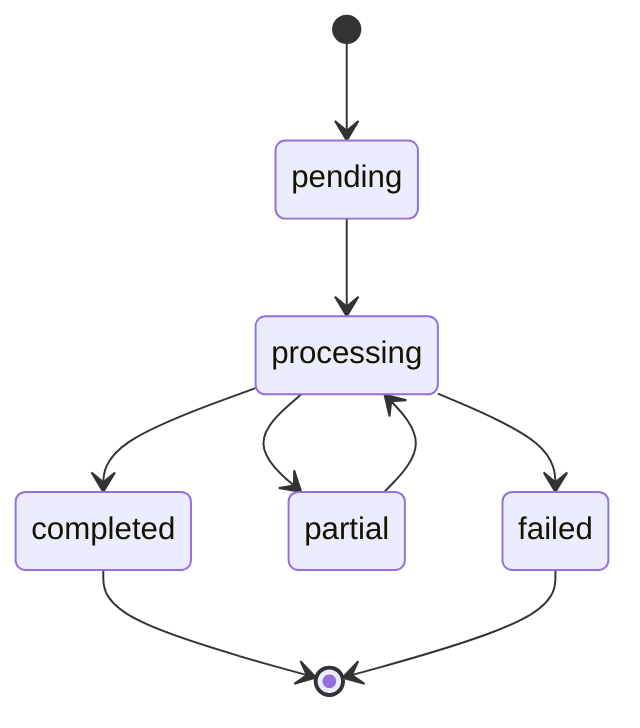

### 6.2 Estados do target (`personalizacao_job_targets.status`)

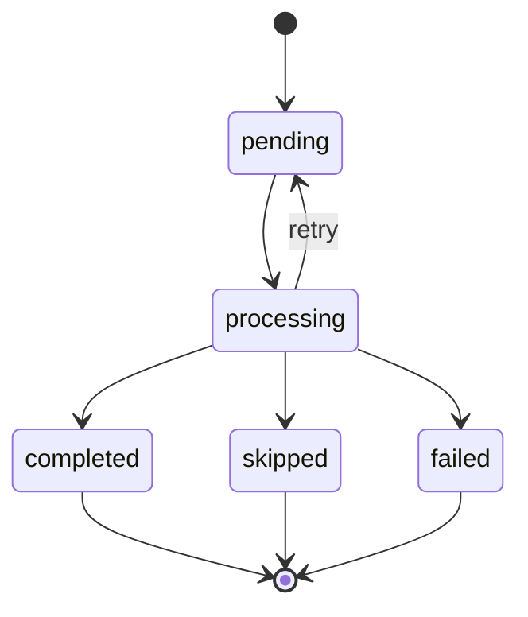

### 6.3 Tabela de transicoes operacionais

| Entidade | Estado | Significado | Proximo estado comum |
|---|---|---|---|
| Job | `pending` | criado, aguardando worker | `processing` |
| Job | `processing` | worker executando targets | `completed`/`partial`/`failed` |
| Job | `partial` | terminou com combinacao de sucesso/falha | `processing` (retry manual) |
| Target | `pending` | aguardando tentativa | `processing` |
| Target | `skipped` | sem regeneracao (hash igual) | final |
| Target | `completed` | regenerado e persistido | final |
| Target | `failed` | excedeu tentativas | final |

## 7. Regra de `nota_estabelecida` (questões)

Campo: `public.questoes.nota_estabelecida numeric(10,2)`

Semântica vigente:
- campo opcional (`NULL` permitido)
- sem `DEFAULT` fixo
- `NULL` representa explicitamente "sem nota definida"

### 7.1 Evolução de migration

| Etapa | Definicao | Efeito |
|---|---|---|
| Migration inicial | `NOT NULL DEFAULT 1` | nota sempre forçada para 1 quando ausente |
| Migration atual | remove `NOT NULL` + remove `DEFAULT` | nota passa a ser realmente opcional |

### 7.2 Diagrama de decisão (semântica atual)

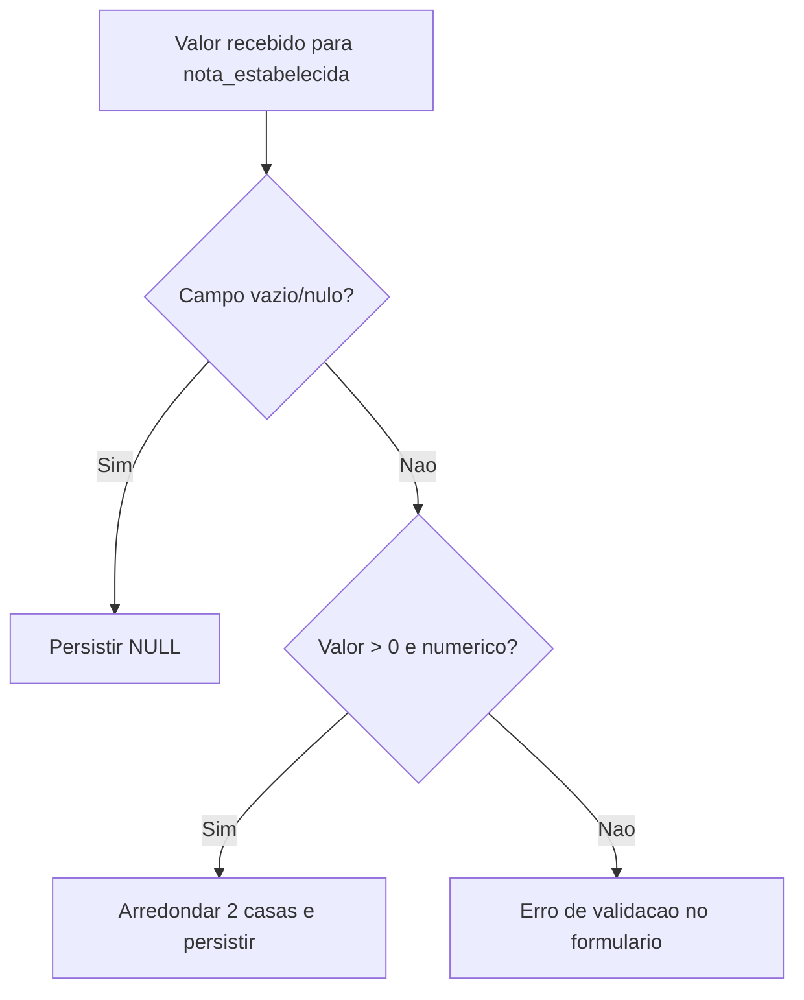

### 7.3 Exemplo de comportamento de correção dissertativa

| Cenário | `notaEstabelecida` no request | `nota_maxima` no retorno |
|---|---|---|
| Questão com nota definida | `10` | `10` |
| Questão sem nota definida | ausente ou `null` | `100` |

## 8. Constraints e indexes críticos

### 8.1 Unicidade/deduplicacao

| Chave | Onde | Objetivo |
|---|---|---|
| `uq_conteudo_personalizado_aluno_topico_ativo` | `conteudo_personalizado` | garantir 1 registro ativo por aluno/tópico |
| `UNIQUE(job_id, aluno_id, topico_id)` | `personalizacao_job_targets` | evitar duplicidade de alvo no mesmo job |
| `uq_personalizacao_item_progresso` | `personalizacao_item_progresso` | evitar item duplicado por aluno/personalização |
| `uq_telemetria_lotes_sessao_captured_at_flush_reason` | `telemetria_lotes` | dedupe de lote |
| `uq_telemetria_eventos_app(sessao_id, client_event_id)` | `telemetria_eventos_app` | dedupe de evento |

### 8.2 Performance

| Index | Tabela | Consulta acelerada |
|---|---|---|
| `idx_personalizacao_jobs_contexto` | `personalizacao_jobs` | listagem por classe/status/tempo |
| `idx_personalizacao_jobs_aluno` | `personalizacao_jobs` | listagem por aluno/status |
| `idx_personalizacao_job_targets_job_status` | `personalizacao_job_targets` | processamento e monitoramento de targets |
| `idx_conteudo_personalizado_aluno_topico` | `conteudo_personalizado` | busca do payload do tópico personalizado |
| `idx_telemetria_*` | telemetria | cortes por sessao/contexto/tempo |

### 8.3 Integridade semântica

- checks de percentual (0-100) em tabelas de progresso
- checks de dominio em `telemetria_eventos_app`:
  - `event_group`
  - `chat_role`
  - `trigger_context`
- check de dominio em `ia_decision_logs.source`

## 9. Views analiticas (catalogo com uso)

| View | Tema | Uso principal |
|---|---|---|
| `vw_rank_posicoes_por_classe` | ranking | consolidar pontuação/posição por classe |
| `vw_metricas_sessoes_aluno_dia` | sessoes | volume de estudo por dia |
| `vw_metricas_engajamento_aluno_classe` | engajamento | sinais de uso por aluno/classe |
| `vw_metricas_desempenho_aluno_classe` | desempenho | acertos, progresso e eficiencia |
| `vw_metricas_comportamento_aluno_classe` | comportamento | padrão de interação e uso |
| `vw_metricas_chat_aluno_classe` | chat | uso e qualidade de interacoes no mentor |
| `vw_metricas_evolucao_desempenho_aluno_dia` | tendencia | serie temporal de desempenho |
| `vw_sequencia_navegacao_aluno` | navegação | trilha percorrida por aluno |
| `vw_ia_decision_logs_resumo` | auditoria IA | resumo de decisões adaptativas |
| `vw_aluno_perfil_segmentos` | perfil | segmento de aluno por afinidade |
| `vw_metricas_turma_geral_classe` | turma | visão consolidada de classe |
| `vw_metricas_turma_perfil_classe` | turma x perfil | comparacao por segmentos |
| `vw_metricas_distribuicao_turma_classe` | distribuição | faixas de nota/tempo/progresso |
| `vw_telemetria_tempo_topico_aluno` | tempo tópico | tempo ativo por tópico |
| `vw_telemetria_tempo_conteudo_aluno` | tempo conteúdo | tempo ativo por conteúdo |
| `vw_telemetria_tempo_atividade_aluno` | tempo atividade | tempo ativo por atividade |

## 10. RLS e seguran?a

RLS habilitado explicitamente em:
- `conteudo_personalizado`
- `personalizacao_item_progresso`
- `personalizacao_jobs`

Policies presentes no SQL manual:
- `Aluno read own conteudo_personalizado`
- `Aluno read own personalizacao_item_progresso`
- `Aluno read own personalizacao_jobs`

### 10.1 Matriz de acesso resumida

| Tabela | Leitura aluno | Leitura professor | Escrita API worker |
|---|---|---|---|
| `conteudo_personalizado` | própria | via endpoint/API de contexto | sim |
| `personalizacao_item_progresso` | própria | via endpoint/API de contexto | sim |
| `personalizacao_jobs` | própria/v?nculo classe | sim (com permissão de classe) | sim |

## 11. Fluxos de escrita/leitura entre sistemas

### 11.1 Quadro de comandos por fluxo

| Fluxo | Sistema de origem | Operação | Destino |
|---|---|---|---|
| Criação/edicao pedagógica | Web | INSERT/UPDATE | tabelas base |
| Disparo de personalização | Web | POST `/api/v1/personalizar/jobs/*` | API |
| Execução de personalização | API worker | UPSERT | `conteudo_personalizado` |
| Seed de progresso personalizado | API worker | UPSERT | `personalizacao_item_progresso` |
| Consumo de personalização | Mobile | SELECT + realtime | `conteudo_personalizado` |
| Progresso personalizado | Mobile | POST `/api/v1/personalizar/progresso` | API -> DB |
| Telemetria normal | Mobile | POST `/api/v1/telemetria/lotes` | API -> DB |
| Telemetria fallback | Mobile | UPSERT/INSERT direto | tabelas de telemetria |

### 11.2 Swimlane de ownership operacional

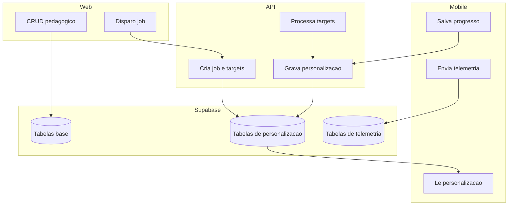

## 12. Checklist de consistencia para evolução de schema

Antes de mudar schema, validar:
1. `src/integrations/supabase/types.ts` (Web)
2. `src/services/personalizacaoApi.ts` e `src/services/telemetriaApi.ts` (Mobile)
3. repositories SQL da API (`app/repositories/*.py`)
4. SQL manual (`sql/manual_supabase_migration.sql`)
5. RLS/policies para tabelas novas de leitura pelo aluno
6. migrações Supabase e semântica de defaults/null

## 13. Estado recomendado para deploy (nota opcional)

No ambiente Supabase alvo, garantir que esta definicao esteja aplicada:

```sql
ALTER TABLE IF EXISTS public.questoes
  ADD COLUMN IF NOT EXISTS nota_estabelecida numeric(10,2);

ALTER TABLE IF EXISTS public.questoes
  ALTER COLUMN nota_estabelecida DROP NOT NULL,
  ALTER COLUMN nota_estabelecida DROP DEFAULT;

COMMENT ON COLUMN public.questoes.nota_estabelecida IS
  'Nota/peso da questao definido pelo professor. Opcional; NULL indica sem nota definida.';
```

Esse estado preserva dados antigos e elimina coercao automatica para `1` em novos registros.

## 14. Edge Functions, RPCs, Functions e Triggers

Esta seção consolida os artefatos de plataforma que conectam o schema ao comportamento em runtime.

### 14.1 Edge Functions consumidas

| Edge Function | Consumidor | Papel |
|---|---|---|
| `generate-content-ai` | Web | Gera sugestões de trilha/conteúdo/cards/atividades para autoria docente |
| `validate-essay-answer-ai` | Web | Corrige questões dissertativas com IA |
| `personalize_path` | Mobile | Retorna topologia da trilha para renderizacao de nodes/edges |

### 14.2 RPCs consumidas no ecossistema

| RPC | Camada consumidora | Finalidade |
|---|---|---|
| `fn_auth_email_exists` | Web | Validação de email no cadastro |
| `fn_cadastrar_aluno_com_perfis` | Web | Onboarding de aluno + perfis BrainHex |
| `inscrever_aluno_em_classe` | Web | Matricula de aluno na classe |
| `fn_atualizar_aluno_perfil` | Mobile | Atualização de dados/perfil do aluno |
| `fn_enviar_contato_sendgrid` | Mobile | Acionamento de contato por email |
| `fn_trilha_by_classe` | Banco (identificada no dump) | Consulta de trilha por classe/aluno |

### 14.3 Functions/trigger-functions SQL identificadas

| Nome | Papel operacional |
|---|---|
| `prevent_topico_cycle` | Evita ciclos no grafo de tópicos (`topico_edges`) |
| `provisionar_estrutura_aluno_classe` | Semeia progresso inicial (`topico_aluno`, `conteudo_aluno`, `atividade_aluno`) |
| `rls_auto_enable` | Habilita RLS automaticamente para novas tabelas em `public` |
| `set_trilha_checkpoint_navegacao_updated_at` | Mantem `updated_at` do checkpoint de navegação |
| `set_updated_at_timestamp` | Helper generico para `updated_at` |
| `update_updated_at_column` | Helper generico para `updated_at` |
| `trg_alunos_after_insert` | Cria v?nculos em `professor_aluno` apos novo aluno |
| `trg_professor_after_insert` | Cria v?nculos em `professor_aluno` apos novo professor |
| `trg_classe_aluno_after_insert` | Dispara provisionamento da estrutura do aluno na classe |
| `trg_topicos_after_insert` | Semeia `topico_aluno` para matriculados |
| `trg_conteudos_after_insert` | Semeia `conteudo_aluno` para matriculados |
| `trg_atividades_after_insert` | Semeia `atividade_aluno` para matriculados |
| `trg_limpar_dados_aluno_classe` | Limpa progresso ao remover matricula do aluno |
| `trg_eventos_aluno_after_ins` | Recalcula ranking e emite notificações/conquistas |

### 14.4 Diagrama das automacoes por trigger

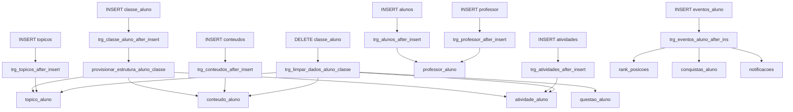

### 14.5 Observações de governan?a

- Parte das rotinas SQL foi identificada no dump de banco e no contrato de consumo do codigo cliente.
- O dump utilizado contem os nomes/corpos de varias routines, mas pode não refletir 100% dos `CREATE FUNCTION/CREATE TRIGGER` originais de migração.
- Para auditoria completa de DDL de routines, manter como fonte primária o histórico de migrações SQL do ambiente Supabase.


## Atualizacoes (2026-04-13)

- Console do professor passou a validar upload com lista fixa de formatos (pdf, doc, docx, ppt, pptx, txt, md, mp3, wav, ogg, mp4, webm, mov) e limite de 200 MB.
- Midia de questoes aceita apenas image/video/audio/pdf.
- Web envia `personalizacaoThemeGuide` (paleta + tom por perfil) para a Edge Function `generate-content-ai`.
- Edge Function inclui um guia de tema e tom no prompt de IA, alinhando a geracao com o tema do mobile.
