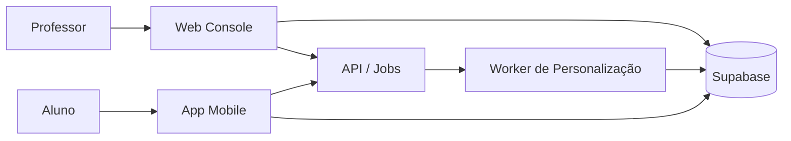
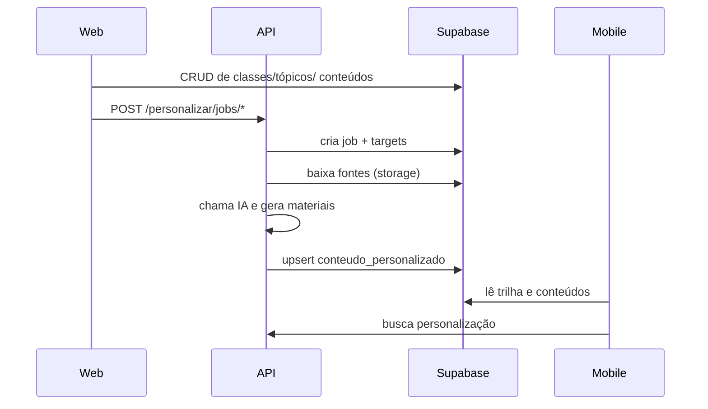

# Guia de Uso do Ecossistema TrailUp

Atualizado em: 2026-04-13

## 1. Objetivo

Este guia explica o funcionamento operacional do TrailUp em todas as frentes (Web, API e Mobile). O foco é uso e operação, não implementação técnica.

## 1.1 Atualizacoes recentes (2026-04-13)

- Personalizacao da API agora funciona em duas fases:
  - retorno rapido com `cards` e `quiz`;
  - midias (`pdf`, `documento`, `apresentacao`, `audio`, `video`) concluidas assincronamente.
- Video personalizado passa a ser publicado como `mp4`.
- Cada midia possui status em `materiais[*].metadata.status`.
- Falhas de fonte/midia n?o derrubam a resposta inicial; o restante segue em background.
- Criacao/atualizacao de classe pode disparar `class_theme_sync` para atualizar `classe_mapa_tema`.

## 2. Visão geral (camadas e fluxo)

## 3. Papel de cada frente

- Web (professor): modelagem pedagógica, gestão de turmas, tópicos, conteúdos e disparo de jobs.
- API: orquestra personalização, integra LLM, atualiza progresso e publica artefatos.
- Mobile (aluno): consome trilha e conteúdo personalizado, envia progresso e telemetria.
- Supabase: banco, storage, auth e realtime.

## 4. Fluxo principal de personalização

1. Professor cria/edita a estrutura pedagógica no Web Console.
2. Web dispara job de personalização (enrollment, class-delta, cleanup ou full-sync).
3. API cria job e targets por aluno x tópico.
4. Worker monta estado, baixa fontes e envia para IA gerar materiais.
5. API salva em `conteudo_personalizado` e publica arquivos no Storage.
6. Mobile consome o conteúdo personalizado.

## 5. Uso do Web Console (professor)

### 5.1 Criar turma, tópicos e dependências

1. Crie a turma e vincule matéria.
2. Crie tópicos com nome, descrição e ordem.
3. Configure dependências (pré-requisitos e próximos).

### 5.2 Criar conteúdos, atividades e questões

- Conteúdos podem conter texto, mídias e arquivos.
- Atividades podem ser quiz, verdadeiro/falso, completar lacuna e dissertativas.
- Nota em dissertativas é opcional: vazio salva `NULL`.

### 5.3 Disparar personalização

Endpoints usados pela Web:

| Ação | Endpoint |
| --- | --- |
| Matrícula (enrollment) | `POST /api/v1/personalizar/jobs/enrollment` |
| Delta de classe | `POST /api/v1/personalizar/jobs/class-delta` |
| Limpeza aluno | `POST /api/v1/personalizar/jobs/student-cleanup` |
| Full sync | `POST /api/v1/personalizar/jobs/full-sync` |

## 6. Uso da API (operação)

- API cria `personalizacao_jobs` e `personalizacao_job_targets`.
- Worker processa targets e atualiza `conteudo_personalizado`.
- Status observáveis em `pending`, `processing`, `completed`, `partial`, `failed`.

## 7. Uso do Mobile (aluno)

1. Login via Supabase Auth.
2. App carrega trilha e conteúdos.
3. Busca personalização do tópico.
4. Exibe conteúdo personalizado ou fallback padrão.
5. Envia progresso e telemetria para API.

## 8. Checklist rápido de integração

- `VITE_APITRAIUP_URL` configurado na Web.
- `EXPO_PUBLIC_APITRAIUP_URL` configurado no Mobile.
- API com `DATABASE_URL`, `SUPABASE_*` e chaves de LLM.
- Supabase com migrations aplicadas.

## 9. Documentos complementares

- Arquitetura geral: `docs/arquitetura-funcionamento-geral-sistema.md`
- Banco Supabase: `docs/estrutura-banco-supabase.md`
- Segurança: `docs/seguranca.md`
- Políticas de dados e privacidade: `docs/politicas-dados-privacidade.md`

## Atualizacoes (2026-04-13)

- Console do professor passou a validar upload com lista fixa de formatos (pdf, doc, docx, ppt, pptx, txt, md, mp3, wav, ogg, mp4, webm, mov) e limite de 200 MB.
- Midia de questoes aceita apenas image/video/audio/pdf.
- Web envia `personalizacaoThemeGuide` (paleta + tom por perfil) para a Edge Function `generate-content-ai`.
- Edge Function inclui um guia de tema e tom no prompt de IA, alinhando a geracao com o tema do mobile.
