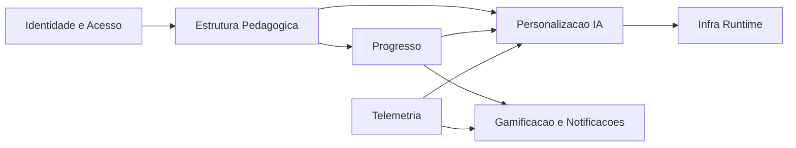
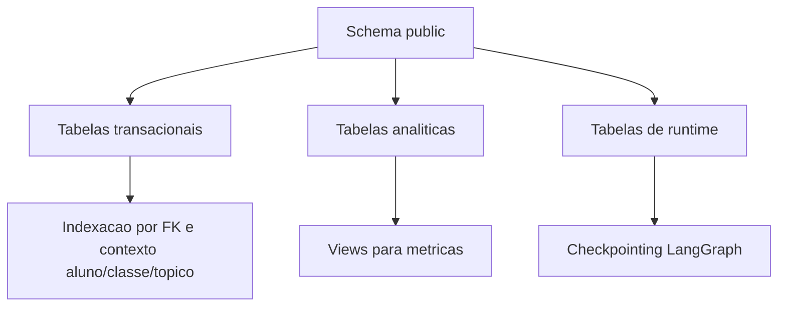
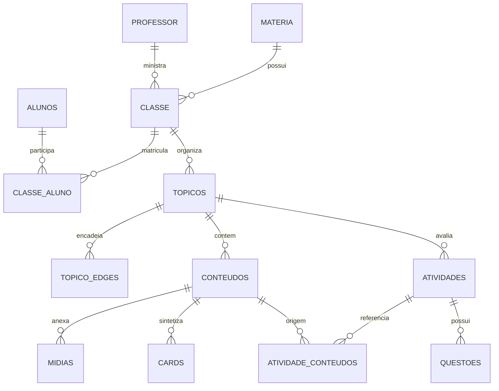
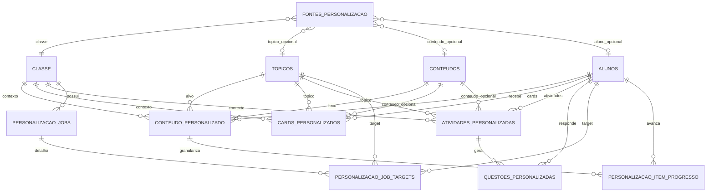
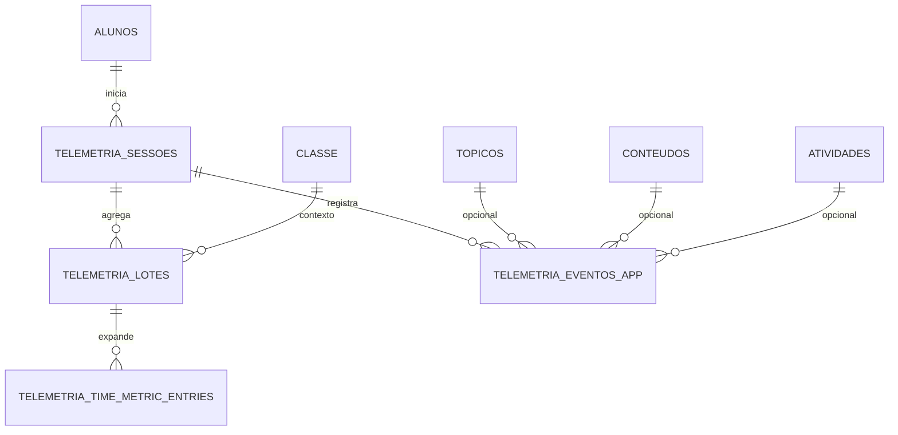
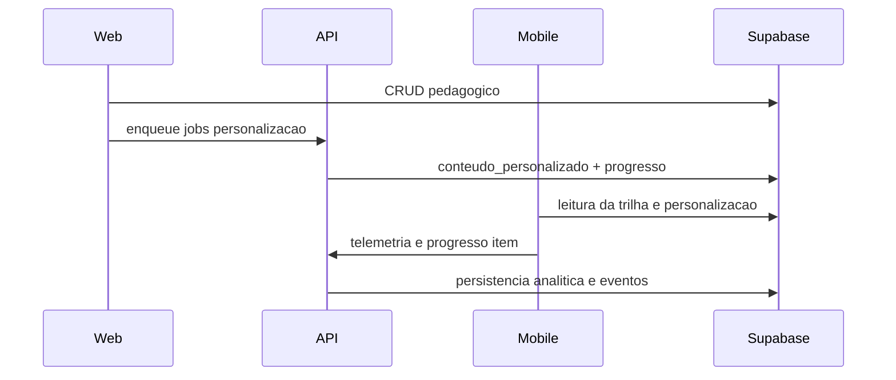

# Modelagem de Dados e Modelagem de Banco (Supabase)

Atualizado em: 2026-04-13

## 1. Objetivo

Este documento consolida:
- modelagem de dados (conceitual e lógica)
- modelagem de banco (fisica no Postgres/Supabase)
- relacoes criticas entre entidades
- ownership de escrita/leitura entre Web, API e Mobile

## 2. Fontes consideradas

- `C:\Users\geisb\Downloads\Banco de dados completo - TrailUp.txt`
- `sql/manual_supabase_migration.sql` (repo API)
- migrations do repo Web em `supabase/migrations/*`

## 3. Modelagem de dados (conceitual)

O dominio foi separado em macro-contextos:
1. Identidade e Acesso
2. Estrutura Pedagógica
3. Progresso de Aprendizagem
4. Personalização e IA
5. Telemetria Comportamental
6. Gamificacao e Notificações
7. Infra de Runtime

## 4. Modelagem lógica por dominio

## 4.1 Identidade e Acesso

Entidades principais:
- `alunos`
- `professor`
- `perfil`
- `aluno_perfil`
- `professor_aluno`
- `modoOperacao`
- `expo_tokens`
- `solicitacoes_exclusao`

Responsabilidade:
- representar identidade acadêmica
- vincular aluno-professor
- armazenar perfil comportamental inicial

## 4.2 Estrutura Pedagógica

Entidades principais:
- `materia`
- `classe`
- `classe_aluno`
- `topicos`
- `topico_edges`
- `conteudos`
- `midias`
- `cards`
- `atividades`
- `atividade_conteudos`
- `questoes`

Responsabilidade:
- representar a trilha de ensino por turma
- mapear dependências de tópicos e recursos didaticos

## 4.3 Progresso de Aprendizagem

Entidades principais:
- `topico_aluno`
- `conteudo_aluno`
- `atividade_aluno`
- `questao_aluno`
- `trilha_aluno`
- `trilha_modelo`
- `trilha_checkpoint_navegacao`
- `eventos_aluno`

Responsabilidade:
- registrar execução e desempenho do aluno no tempo

## 4.4 Personalização e IA

Entidades principais:
- `conteudo_personalizado`
- `fontes_personalizacao`
- `personalizacao_jobs`
- `personalizacao_job_targets`
- `personalizacao_item_progresso`
- `materiais_gerados`
- `iaDescricao`
- `ia_decision_logs`
- `classe_mapa_tema`

Responsabilidade:
- gerar, versionar e rastrear conteúdo adaptado por aluno/tópico
- operacionalizar fila de jobs assínc

## 4.5 Telemetria Comportamental

Entidades principais:
- `telemetria_sessoes`
- `telemetria_lotes`
- `telemetria_eventos_app`
- `telemetria_time_metric_entries`

Responsabilidade:
- capturar comportamento de uso
- alimentar análise adaptativa e visoes analiticas

## 4.6 Gamificacao e Notificações

Entidades principais:
- `conquistas`
- `conquistas_aluno`
- `rank_tipo`
- `ranks`
- `rank_posicoes`
- `notificacoes`
- `notificacoes_agendamentos`
- `notificacoes_ia`
- `notificacoes_pendentes`

Responsabilidade:
- engajamento, ranking e comunicação com aluno/professor

## 4.7 Infra de Runtime

Entidades principais:
- `checkpoints`
- `checkpoint_blobs`
- `checkpoint_writes`
- `checkpoint_migrations`
- `alembic_version`

Responsabilidade:
- persist?ncia de estado do workflow/graph e versionamento de schema

## 5. Modelagem fisica do banco

No dump de referencia existem 53 `CREATE TABLE` no schema `public`.

Caracteristicas fisicas relevantes:
- chaves primarias majoritariamente `bigint identity` e `uuid`.
- relacionamentos com FKs para consistencia de dominio.
- campos `json/jsonb` para payload flexivel de IA e telemetria.
- indices focados em contexto operacional (`aluno_id`, `classe_id`, `topico_id`, `updated_at`).

## 6. Diagramas ER por fluxo crítico

## 6.1 ER Pedagógico

## 6.2 ER Personalização

## 6.3 ER Telemetria

## 7. Ownership de dados por sistema

| Dominio | Web | API | Mobile |
|---|---|---|---|
| Estrutura pedagógica | escrita principal | leitura/apoio | leitura |
| Personalização em lote | dispara jobs | escrita principal | leitura |
| Progresso personalizado | suporte | escrita validada | escrita via API |
| Telemetria | não principal | escrita/processamento principal | escrita principal (origem dos sinais) |
| Gamificacao/rank | leitura parcial | calculo/apoio | leitura principal |

## 8. Regras importantes de modelagem

## 8.1 `questoes.nota_estabelecida` opcional

Semântica atual:
- `NULL` = sem nota definida
- sem fallback automatico para `1`
- dados antigos não são reescritos automaticamente

Impacto:
- frontend deve validar campo preenchido `> 0`
- sem preenchimento, persistir `NULL`
- correção dissertativa sem nota usa escala 0-100

## 8.2 Chaves e consistencia

Padrões praticos:
- usar PK surrogate para identidade técnica.
- manter FK para encadear dominio pedagógico.
- em tabelas de evento/telemetria, usar combinacao de ids e timestamps.
- em personalização, garantir unicidade por contexto operacional quando necessario.

## 9. Views analiticas e consumo

O modelo inclui views para facilitar leitura de métricas, por exemplo:
- `vw_rank_posicoes_por_classe`
- `vw_metricas_*` (engajamento, desempenho, evolução, distribuição)
- `vw_telemetria_tempo_*`
- `vw_ia_decision_logs_resumo`

Uso:
- dashboards docentes/operacionais
- indicadores de risco e comportamento
- suporte a decisões de personalização

## 10. Functions e triggers custom

Nos artefatos locais versionados analisados:
- não ha `CREATE FUNCTION` custom versionado
- não ha `CREATE TRIGGER` custom versionado

Se existirem no ambiente remoto, recomenda-se exportar e versionar junto das migrations para evitar drift.

## 11. Ciclo de vida dos dados

## 12. Checklist de evolução segura da modelagem

1. versionar toda mudanca em migration idempotente.
2. atualizar tipos TS/Pydantic apos mudanca de schema.
3. validar impacto em Web/API/Mobile antes de deploy.
4. revisar indices quando inserir novas consultas por contexto.
5. manter documentação de dominio sincronizada com schema real.

## Atualizacoes (2026-04-13)

- Console do professor passou a validar upload com lista fixa de formatos (pdf, doc, docx, ppt, pptx, txt, md, mp3, wav, ogg, mp4, webm, mov) e limite de 200 MB.
- Midia de questoes aceita apenas image/video/audio/pdf.
- Web envia `personalizacaoThemeGuide` (paleta + tom por perfil) para a Edge Function `generate-content-ai`.
- Edge Function inclui um guia de tema e tom no prompt de IA, alinhando a geracao com o tema do mobile.
