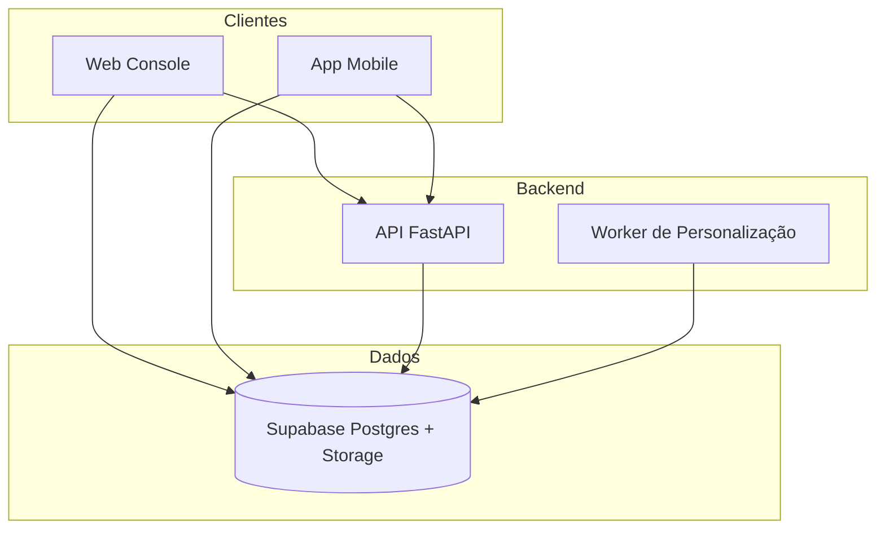

# Segurança do Ecossistema TrailUp

Atualizado em: 2026-04-13

## 1. Objetivo

Este documento define a abordagem de segurança operacional do TrailUp (Web, API, Mobile e Supabase). Ele não substitui políticas legais, mas guia práticas técnicas.

## 2. Visão geral de camadas

## 3. Controles principais

| Camada | Controle | Objetivo |
| --- | --- | --- |
| Web | Supabase Auth + RLS | Autenticação e autorização do professor | 
| API | JWT e validação de payload | Controle de acesso aos endpoints | 
| Mobile | Tokens curtos | Sessão segura do aluno | 
| Supabase | RLS + policies | Isolamento de dados | 
| Storage | Buckets privados e públicos | Controle de conteúdo personalizado | 

## 4. Identidade e acesso

- Autenticação central via Supabase Auth.
- Separação clara entre roles: professor, aluno e serviços internos.
- Tokens sensíveis devem ficar no backend (service key nunca no cliente).

## 5. Segurança de dados

- Dados sensíveis trafegam somente via HTTPS.
- Conteúdos personalizados são versionados e associados a aluno/classe/tópico.
- Logging evita conteúdo sensível em texto puro.

## 6. Segurança de IA

- O conteúdo enviado ao LLM é mínimo e contextual.
- Fontes são baixadas e normalizadas antes do envio ao modelo.
- Prompting inclui instruções para consistência e limites de saída.

## 7. Backup e recuperação

- Postgres com backups automáticos do Supabase.
- Storage com versionamento por caminho e referência (quando disponível).
- Procedimento de recuperação testado por amostra.

## 8. Monitoramento e incidentes

- Monitorar `personalizacao_jobs` e `conteudo_personalizado`.
- Alertas para `error_count` e falhas recorrentes.
- Incidentes críticos exigem isolamento do aluno e auditoria.

## 9. Checklist mínimo

- RLS ativa nas tabelas de dados sensíveis.
- Service key só no backend.
- Variáveis de ambiente protegidas.
- Logs com mascaramento de tokens e e-mails.

## 10. Observações

Este documento deve ser revisado periodicamente junto com a equipe jurídica e de compliance.

## Atualizacoes (2026-04-13)

- Console do professor passou a validar upload com lista fixa de formatos (pdf, doc, docx, ppt, pptx, txt, md, mp3, wav, ogg, mp4, webm, mov) e limite de 200 MB.
- Midia de questoes aceita apenas image/video/audio/pdf.
- Web envia `personalizacaoThemeGuide` (paleta + tom por perfil) para a Edge Function `generate-content-ai`.
- Edge Function inclui um guia de tema e tom no prompt de IA, alinhando a geracao com o tema do mobile.
