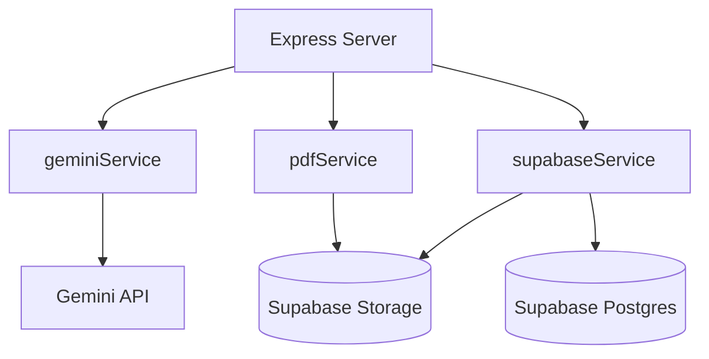
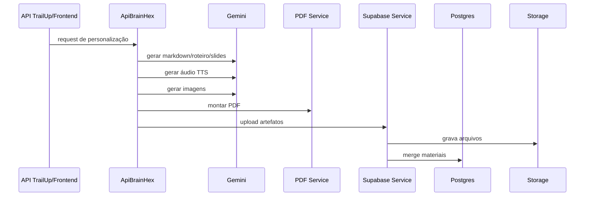

# Arquitetura do Microserviço ApiBrainHex - Versão Detalhada

## 1. Objetivo
Documentar arquitetura interna do microserviço responsável por geração multimídia pedagógica por perfil BrainHex.

## 2. Escopo
- endpoints de backend
- pipeline Gemini
- montagem de PDF
- upload de artefatos
- merge de materiais no banco

## 3. Diagrama de componentes

## 4. Endpoints e responsabilidade
### `GET /api/health`
- healthcheck de disponibilidade

### `POST /api/personalizar`
- entrada principal para integração com API TrailUp
- retorna `202` e processa pipeline

### `POST /api/v1/archive`
- modo de arquivamento direto (frontend)

## 5. Pipeline detalhado

## 6. Modelagem de artefatos
- unidade lógica por `personalizacao_id`
- artefatos por tipo: markdown, áudio, apresentação
- status por artefato (`pending`, `completed`, `failed`)

## 7. Segurança e governança
- secrets via env (`GEMINI_API_KEY`, `SUPABASE_SERVICE_ROLE_KEY`)
- service role restrita ao backend
- validação de perfil e payload

## 8. Observabilidade
- logs por etapa de pipeline
- contagem de falhas por artefato
- latência total e por etapa

## 9. Riscos e mitigação
- rate limit de modelo: retry/backoff
- falha parcial: não bloquear artefatos concluídos
- overwrite indevido: merge seguro

## 10. Objetivos operacionais
- alta taxa de conclusão por artefato
- previsibilidade de tempo de geração
- consistência de estilo por perfil BrainHex
