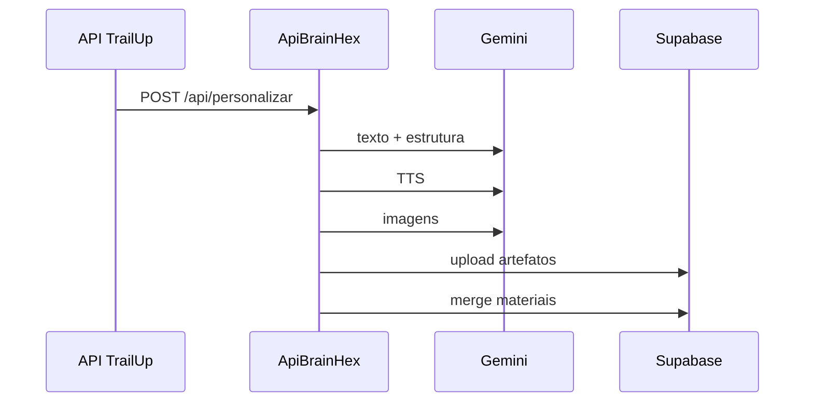

# Funcionamento Detalhado - Personalização, Gamificação e Recursos Pedagógicos (ApiBrainHex)

## 1. Objetivo
Explicar como o microserviço transforma contexto pedagógico em artefatos personalizados e como isso sustenta gamificação no ecossistema.

## 2. Personalização
### Entrada
- perfil BrainHex
- contexto pedagógico do tópico
- IDs de rastreio (`personalizacao_id`, `classe_id`, `topico_id`)

### Processamento
- geração textual estruturada
- adaptação de tom por perfil
- síntese de áudio com voz mapeada por perfil
- composição visual para apresentação

### Motivos
- aumentar conexão do aluno com o conteúdo
- reforçar compreensão por narrativa alinhada ao perfil

### Objetivos
- elevar engajamento de estudo
- reduzir abandono em tópicos difíceis

## 3. Gamificação (contribuição indireta)
O microserviço não calcula rank, mas impacta gamificação ao:
- melhorar qualidade e aderência do material
- aumentar chance de progresso e pontuação no app

## 4. Recursos pedagógicos aplicados
- markdown didático
- áudio narrado
- apresentação visual

### Motivos
- aprendizagem multimodal
- reforço por múltiplos canais

### Objetivos
- melhor retenção
- melhor transferência para atividade

## 5. Fluxo detalhado

## 6. Regras de robustez
- status por artefato
- tolerância a falha parcial
- merge sem sobrescrever concluído

## 7. Indicadores recomendados
- sucesso por artefato
- latência média por pipeline
- falha por etapa/modelo
- cobertura por perfil BrainHex
