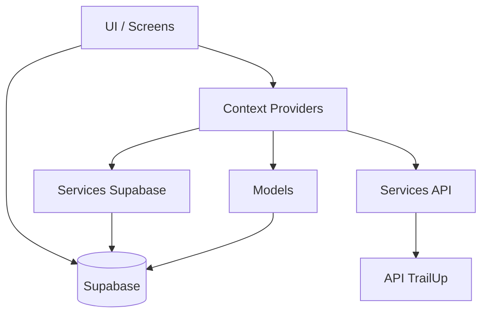
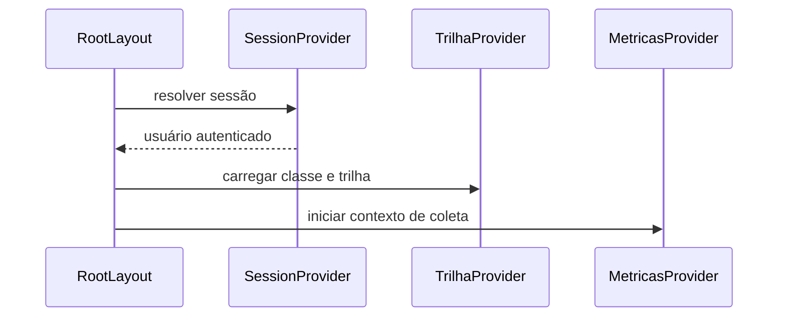
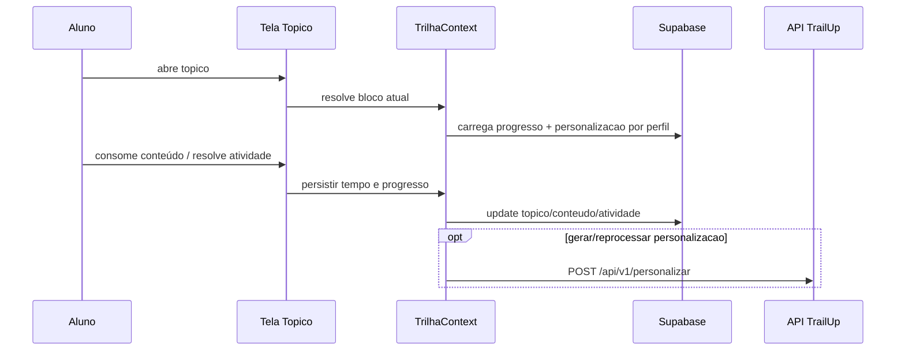

# Arquitetura do App Mobile - Versão Detalhada

## 1. Objetivo
Documentar arquitetura completa do app do aluno, separada da arquitetura do microserviço de mídia.

## 2. Escopo
- navegação
- estado global
- dados e persistência
- integração com Supabase (leitura) e API (orquestração)
- renderização multimídia
- telemetria

## 3. Diagrama de componentes

## 4. Camadas internas
### 4.1 Apresentação
- `src/app`
- `src/screens`
- `src/components`

### 4.2 Estado de aplicação
- `SessaoContext`
- `TrilhaContext`
- `IAContext`
- `MetricasContext`
- `ConquistaRankContext`
- `NotificacaoContext`

### 4.3 Domínio e persistência
- `src/models` para operações de leitura/escrita no Supabase

### 4.4 Integração externa
- `personalizacaoApi.ts`
- `telemetriaApi.ts`

## 5. Bootstrap e ciclo de vida

## 6. Fluxo de estudo

## 7. Persistência de tempo e progresso
### Princípio
O app deve persistir tempo ativo nos níveis:
- tópico
- conteúdo
- atividade

### Motivo
Sem persistência consistente de tempo/progresso, ranking, gráficos e feedback pedagógico ficam incorretos.

## 8. Ranking no app
- fonte de leitura recomendada: `vw_rank_posicoes_por_classe`
- evitar leitura direta de `rank_posicoes`
- ranking depende da cadeia completa: progresso + eventos + SQL de consolidação

## 9. Renderização multimídia
### Formatos
- markdown
- áudio
- vídeo (arquivo/embed)
- pdf
- docx
- pptx
- cards

### Estratégia
1. renderizador nativo
2. fallback seguro
3. continuidade do estudo mesmo com falha parcial

## 10. Telemetria
- coleta sinais de interação e contexto de estudo
- envia lotes para API
- deve respeitar consentimento e disponibilidade de rede

## 11. Segurança
- sessão Supabase
- tokens não logados
- validação de payload antes de persistência

## 12. Riscos e mitigação
- rede instável: retries + fallback de fluxo
- payload inconsistente: normalização no app
- artefato indisponível: fallback de visualização

## 13. Objetivos de qualidade
- UX contínua
- progresso confiável
- baixa fricção de consumo
- consistência visual por perfil BrainHex
