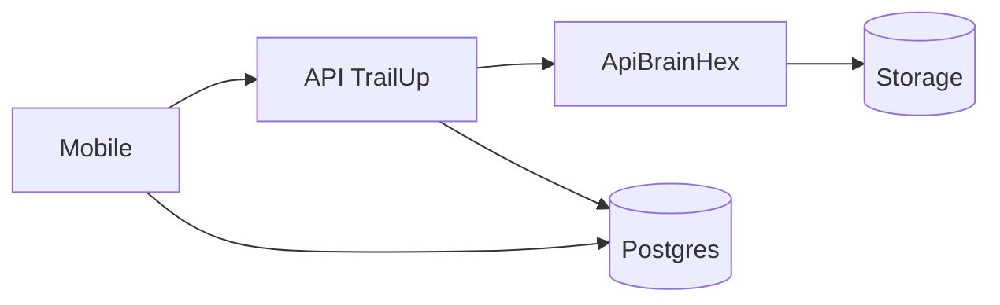

# Arquitetura do Microserviço (consumo pelo Mobile) - Versão Detalhada

## 1. Objetivo
Descrever como o app mobile consome resultados produzidos pelo microserviço ApiBrainHex sem acoplamento direto de implementação.

## 2. Separação de responsabilidades
- app mobile: consumo e exibição
- API TrailUp: orquestração
- ApiBrainHex: geração multimídia

## 3. Fluxo de dependência

## 4. Contrato efetivo para o app
O app consome `conteudo_personalizado.materiais`, incluindo:
- `arquivo_url`
- `storage_path`
- `metadata.status`
- metadados de tipo

## 5. Estados de artefato
- `pending`: em processamento
- `completed`: disponível
- `failed`: erro

## 6. Comportamento esperado no app
- `completed`: renderizar
- `pending`: placeholder + polling/reload eventual
- `failed`: fallback para conteúdo base

## 7. Motivos e objetivos
### Motivos
- desacoplar app de pipeline pesado
- manter atualização de mídia transparente para o aluno

### Objetivos
- reduzir quebras de UX
- preservar continuidade pedagógica
- manter robustez em falha parcial
