# Funcionamento da API TrailUp: Arquitetura, Fluxos e Responsabilidades

Atualizado em: 2026-04-13

## 1. Objetivo

Este documento descreve como a API TrailUp funciona em producao e como ela se integra com Web, Mobile e Supabase.

Escopo:
- arquitetura técnica da API
- responsabilidades por camada e por repositório
- fluxos operacionais principais (personalização, chat, telemetria)
- contratos HTTP relevantes
- dependências de banco, storage, views e edge functions

## 1.1 Atualizacoes recentes (2026-04-13)

- Pipeline de midias da personalizacao refatorado para DAG com estagios explicitos:
  - `input -> normalize -> generate -> render -> output`.
  - Implementacao central: `app/services/media_pipeline.py`.
- Estrategia fast-first aplicada no runtime:
  - resposta inicial prioriza `cards` e `quiz`;
  - midias (`pdf`, `documento`, `apresentacao`, `audio`, `video`) seguem assincronas.
- Geracao de `video` mudou para `mp4` minimo com `MoviePy + ffmpeg` (`app/services/video.py`).
- Fallback parcial por falha de fonte/midia:
  - personalizacao rapida permanece disponivel;
  - status por artefato em `materiais[*].metadata.status` (`pending|completed|failed`).
- Fluxo `class_theme_sync` consolidado:
  - trigger SQL em `classe` enfileira job em `personalizacao_jobs`;
  - worker popula/atualiza `classe_mapa_tema`.

## 2. Papel da API no ecossistema

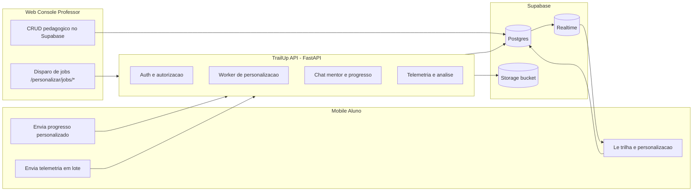

Resumo:
- Web controla modelagem pedagógica e orquestracao de jobs.
- API executa regras de negocio server-side e geração assínc.
- Mobile consome dados persistidos e envia sinais de uso/progresso.
- Supabase concentra persistencia, storage e realtime.

## 3. Arquitetura técnica da API

## 3.1 Camadas

| Camada | Responsabilidade | Arquivos centrais |
|---|---|---|
| API Layer | Rotas HTTP, validação inicial, mapeamento de payload/response | `app/api/router.py`, `app/api/v1/*.py` |
| Auth Layer | JWT Supabase, fallback em `/auth/v1/user`, resolução de identidade e papeis | `app/services/auth.py`, `app/api/deps.py` |
| Service Layer | Orquestracao de personalização, jobs, telemetria, storage | `app/services/personalizacao.py`, `app/services/personalizacao_jobs.py`, `app/services/analysis_runner.py`, `app/services/storage.py` |
| Agent Layer | Grafo LangGraph para workflows personalização/análise | `app/agent/graph/builder.py`, `app/agent/graph/routing.py`, `app/agent/graph/nodes/*` |
| Repository Layer | SQL encapsulado por dominio | `app/repositories/*.py` |
| Persistence Layer | Postgres (Supabase) + buckets | tabelas `public.*` e bucket de artefatos |

## 3.1.1 Diagrama por camada

### API Layer

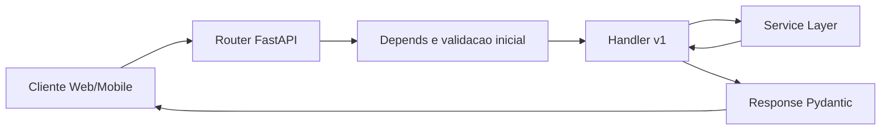

### Auth Layer

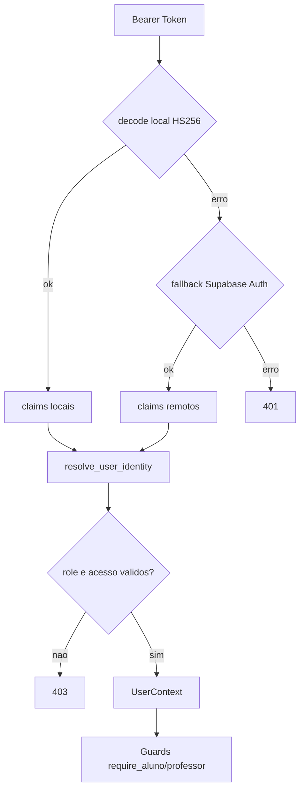

### Service Layer

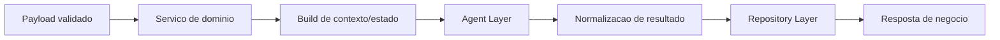

### Agent Layer

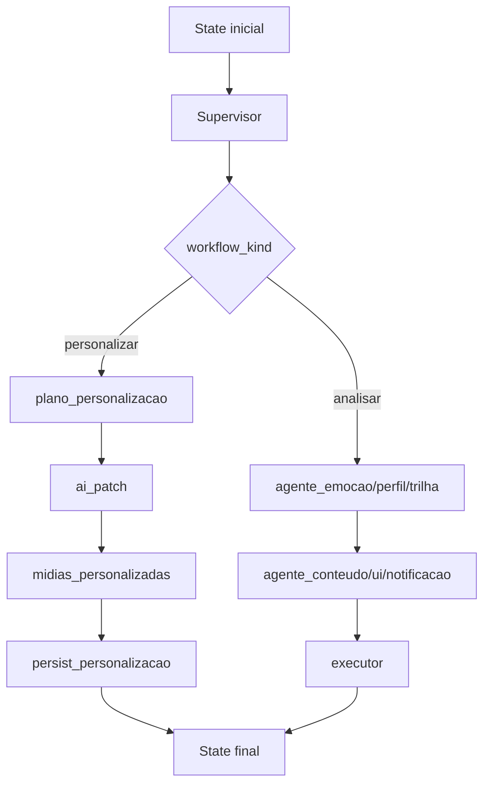

### Repository Layer

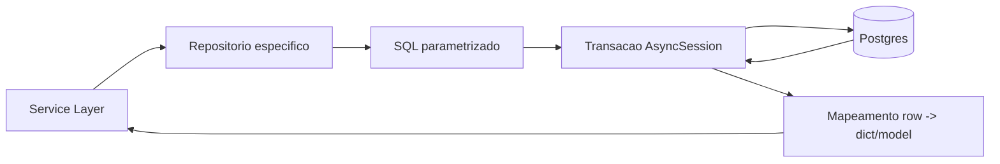

### Persistence Layer

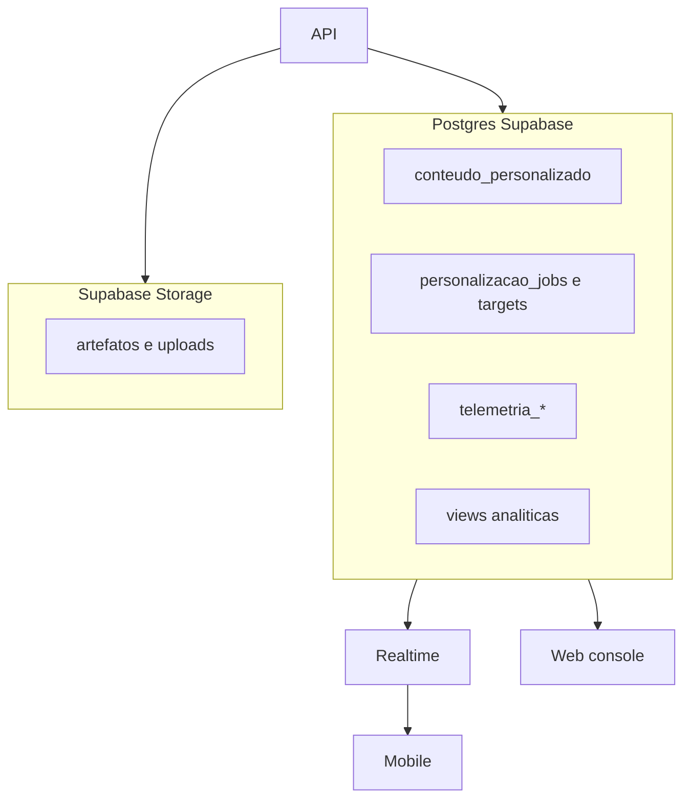

## 3.2 Composicao de rotas

`app/api/router.py` monta:
- `/health`
- `/admin/*`
- `/api/v1/admin/*`
- `/api/v1/emocoes/*`
- `/api/v1/materiais/*`
- `/api/v1/personalizar/*`
- `/api/v1/telemetria/*`

## 3.3 Inicializacao runtime

`app/main.py`:
1. cria `engine` e `session_factory`
2. inicializa checkpointer persistente (personalização) e efemero
3. compila dois grafos:
- `graph_personalizacao`
- `graph_ephemeral`
4. inicia retention de checkpoints quando habilitado
5. inicia loop de jobs de personalização quando DB e Postgres

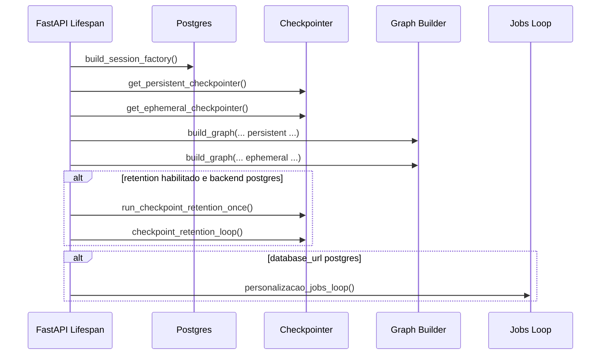

## 4. Seguranca e autorização

## 4.1 Fluxo de autenticação

`Authorization: Bearer <token>`:
1. tenta `jwt.decode` local com `SUPABASE_JWT_SECRET`
2. se falhar, tenta resolver token no Supabase Auth (`/auth/v1/user`)
3. resolve identidade em banco (`AccessRepository`)
4. aplica regras de acesso:
- `aluno`
- `professor` + `professor_liberado=true`

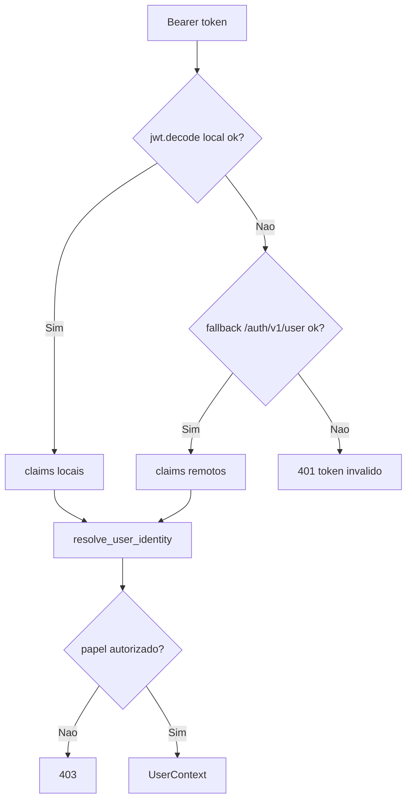

## 4.2 Controle por endpoint

| Grupo | Usuario permitido | Regra complementar |
|---|---|---|
| `/api/v1/personalizar` (POST) | aluno | precisa informar `topico_id` ou `conteudo_id` |
| `/api/v1/personalizar/progresso` | aluno | so atualiza progresso do próprio `personalizacao_id` |
| `/api/v1/personalizar/chat` | aluno | chat sem entrega de gabarito |
| `/api/v1/personalizar/jobs/*` | professor | professor precisa ser dono da classe |
| `/api/v1/personalizar/contexto/{aluno_id}` | professor | precisa ter acesso ao aluno |
| `/api/v1/materiais/{aluno_id}` | aluno/professor | aluno ve o próprio; professor com acesso |
| `/api/v1/telemetria/lotes` | aluno | sessao e lote gravados por aluno autenticado |
| `/api/v1/admin/*` e `/admin/*` | basic auth admin | usuario/senha de admin panel |

## 5. Contratos HTTP principais

## 5.1 Personalização

| Endpoint | Metodo | Finalidade |
|---|---|---|
| `/api/v1/personalizar` | POST | gera personalização imediata para aluno |
| `/api/v1/personalizar/{aluno_id}` | GET | lista personalizações persistidas |
| `/api/v1/personalizar/progresso` | POST | upsert de progresso por item personalizado |
| `/api/v1/personalizar/chat` | POST | chat de mentor contextual |
| `/api/v1/personalizar/fontes` | POST multipart | upload/link de fontes de personalização |
| `/api/v1/personalizar/contexto/{aluno_id}` | GET | visão docente (contexto + personalização + progresso) |

## 5.2 Jobs assínc de personalização

| Endpoint | Metodo | Kind interno |
|---|---|---|
| `/api/v1/personalizar/jobs/enrollment` | POST | `student_enrollment` |
| `/api/v1/personalizar/jobs/class-delta` | POST | `class_delta_sync` |
| `/api/v1/personalizar/jobs/student-cleanup` | POST | `student_cleanup` |
| `/api/v1/personalizar/jobs/full-sync` | POST | `full_class_sync` |
| `/api/v1/personalizar/jobs` | GET | listagem com filtros |
| `/api/v1/personalizar/jobs/{job_id}` | GET | detalhe + targets |

## 5.3 Telemetria e análise

| Endpoint | Metodo | Finalidade |
|---|---|---|
| `/api/v1/telemetria/lotes` | POST | ingestao de lote de sinais e eventos app |
| `/api/v1/emocoes/analisar` | POST | análise pontual |
| `/api/v1/emocoes/analisar-stream` | POST | streaming SSE de análise |

## 6. Fluxo de personalização (motor principal)

## 6.1 Fontes de dados para montar estado

`build_personalizacao_state` combina:
- contexto do aluno (`ContextRepository`)
- estrutura da classe/tópico/conteúdo (`ConteudoClasseRepository`)
- fontes estruturadas (`fontes_personalizacao`)
- snapshot do cliente e materiais de origem enviados no payload
- sinais tópico: `cards`, `atividades`, `questoes`

No final, gera `source_hash` (sha256) para deduplicacao.

## 6.2 Fluxo on-demand (`POST /api/v1/personalizar`)

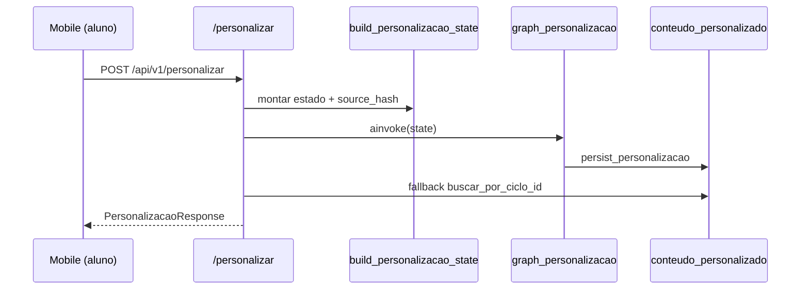

## 6.3 Fluxo assínc por jobs

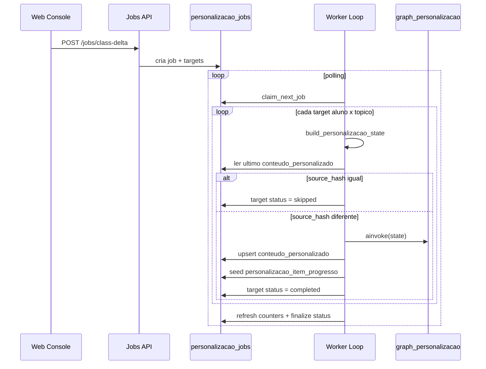

## 6.4 Estados de job e target

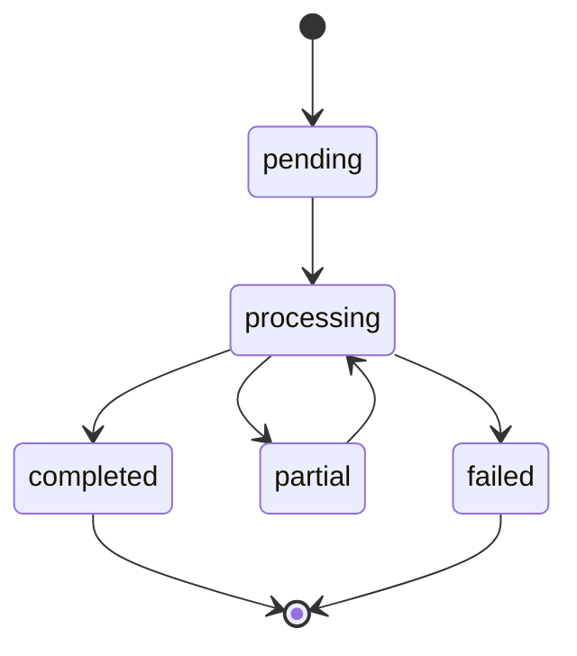

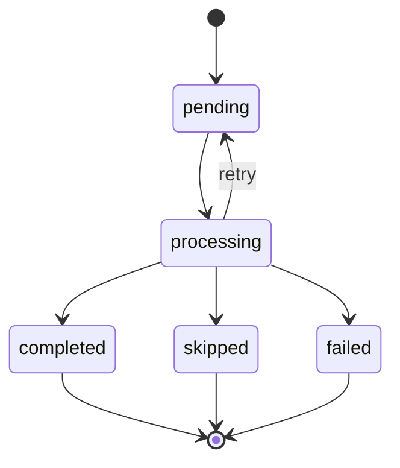

## 6.5 Tipos de job e uso esperado

| Kind | Quando usar | Efeito |
|---|---|---|
| `student_enrollment` | entrada de aluno em classe | gera trilha personalizada inicial |
| `class_delta_sync` | mudanca de conteúdo/tópico/atividade | recalcula afetados na classe |
| `full_class_sync` | reconciliacao ampla | recalcula todos aluno x tópico |
| `student_cleanup` | remocao de aluno / limpeza | remove personalização, progresso, fontes e artefatos |
| `manual_retry` | recuperacao operacional | reprocessa itens com falha |

## 7. Tipos de personalização e como são gerados

O plano pode recomendar multiplos formatos; normalização aceita:
- `pdf`
- `cards`
- `quiz`
- `video`
- `audio`
- `documento`
- `apresentacao`
- `imagem`

Pipeline funcional:
1. `generate_plano_personalizacao`: estratégia e formato prioritario.
2. `generate_ai_patch_personalizacao`: ajustes comportamentais e UI.
3. `generate_materiais_personalizados`: payload final de materiais e artefatos.
4. `persist_personalizacao_record`: grava `conteudo_personalizado`.
5. `build_personalizacao_steps`: deriva passos para `personalizacao_item_progresso`.

## 8. Fluxo de chat mentor e progresso

## 8.1 Chat mentor (`/api/v1/personalizar/chat`)

- usa contexto do aluno + última personalização do tópico/conteúdo
- aplica guardrails anti-gabarito
- tenta resposta LLM (`mentor_personalizacao_chat.txt`)
- fallback deterministico quando necessario
- auditoria de decisão em `ia_decision_logs`

## 8.2 Progresso personalizado (`/api/v1/personalizar/progresso`)

- upsert por chave unica `(aluno_id, personalizacao_id, item_key)`
- atualiza status, percentual, tempo e pontuação
- em conclusão com ganho real de score, publica evento em `eventos_aluno`

## 9. Fluxo de telemetria

`POST /api/v1/telemetria/lotes`:
1. sanitiza payload (não persiste frame base64 bruto no payload final)
2. normaliza sinais para eventos legados
3. upsert de `telemetria_sessoes`
4. insert idempotente de `telemetria_lotes`
5. insert de eventos app e métricas de tempo
6. executa `run_analysis` e anexa resumo no lote

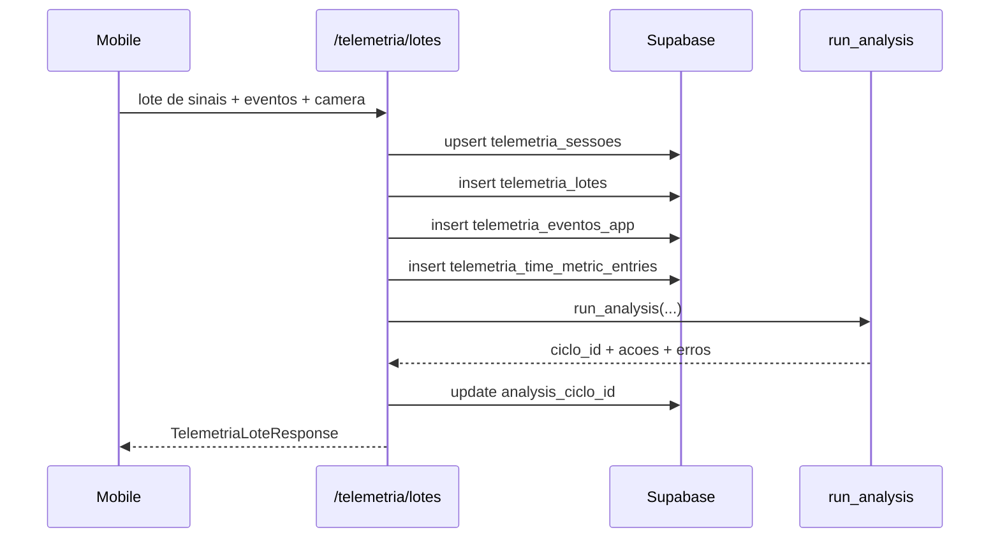

Observação:
- no Mobile existe fallback para gravacao direta no Supabase quando API indisponível.

## 10. Banco de dados usado pela API

## 10.1 Tabelas de runtime mais sensiveis

| Dominio | Tabelas |
|---|---|
| Personalização | `conteudo_personalizado`, `fontes_personalizacao`, `personalizacao_jobs`, `personalizacao_job_targets`, `personalizacao_item_progresso`, `materiais_gerados`, `ia_decision_logs` |
| Telemetria | `telemetria_sessoes`, `telemetria_lotes`, `telemetria_eventos_app`, `telemetria_time_metric_entries` |
| Análise/progresso | `eventos_aluno`, `atividade_aluno`, `questao_aluno`, `topico_aluno`, `conteudo_aluno` |
| Infra LangGraph | `checkpoints`, `checkpoint_blobs`, `checkpoint_writes`, `checkpoint_migrations` |

## 10.2 Views analiticas versionadas

No SQL versionado (`sql/manual_supabase_migration.sql`) existem views como:
- `vw_rank_posicoes_por_classe`
- `vw_metricas_sessoes_aluno_dia`
- `vw_metricas_engajamento_aluno_classe`
- `vw_metricas_desempenho_aluno_classe`
- `vw_metricas_comportamento_aluno_classe`
- `vw_metricas_chat_aluno_classe`
- `vw_metricas_evolucao_desempenho_aluno_dia`
- `vw_sequencia_navegacao_aluno`
- `vw_ia_decision_logs_resumo`
- `vw_telemetria_tempo_topico_aluno`
- `vw_telemetria_tempo_conteudo_aluno`
- `vw_telemetria_tempo_atividade_aluno`

## 10.3 Functions e triggers

Nos artefatos SQL versionados nos repositórios analisados:
- ha `CREATE FUNCTION`/`CREATE TRIGGER` custom versionado para `eventos_aluno` (ver `sql/20260417_05_eventos_aluno_trigger_iud.sql`).

Se houver functions/triggers adicionais no projeto Supabase hospedado, eles não estão representados nesses artefatos locais e devem ser exportados para versionamento.

## 11. Integrações com Edge Functions (Web)

Edge Functions no repo Web:
- `supabase/functions/generate-content-ai`
- `supabase/functions/validate-essay-answer-ai`

Papel:
- não substituem o worker da API
- complementam o fluxo docente (geração assistida e correção dissertativa)

Regra de nota da dissertativa:
- com `notaEstabelecida`, usa nota informada
- sem `notaEstabelecida`, escala padrão 0-100 (`nota_maxima = 100`)

## 12. Matriz de responsabilidades por repositório

| Repositório | Responsabilidade primária | Relacao com a API |
|---|---|---|
| Web (`brainhex-navigator`) | Console do professor e disparo de jobs | cliente de `/api/v1/personalizar/jobs/*`, contexto docente e edge functions |
| API (`ApiTraiUp`) | Lógica central server-side e worker assínc | fonte de verdade dos fluxos de personalização/chat/telemetria |
| Mobile (`trailup-app-dsm-2502`) | Experiência do aluno e envio de sinais | consome personalização, envia progresso/chat/telemetria |

## 13. Configuração operacional critica

| Variavel | Uso |
|---|---|
| `DATABASE_URL` | conexão principal para repositórios SQL |
| `LANGGRAPH_DB_URL` | backend de checkpoint quando aplicavel |
| `SUPABASE_URL` | base URL do projeto Supabase |
| `SUPABASE_SERVICE_KEY` | acesso server-side a Auth/Storage |
| `SUPABASE_JWT_SECRET` | validação local de bearer token |
| `LLM_PROVIDER` | seletor `openai` ou `gemini` |
| `OPENAI_API_KEY` / `GEMINI_API_KEY` | credenciais do provedor LLM |
| `PERSONALIZACAO_JOB_CONCURRENCY` | paralelismo do worker |
| `PERSONALIZACAO_JOB_POLL_SEC` | intervalo de polling |
| `PERSONALIZACAO_JOB_MAX_RETRIES` | retries por target |
| `CHECKPOINT_RETENTION_*` | politica de limpeza de checkpoint |

## 14. Operação, saude e diagnostico

`GET /health` informa:
- ambiente
- status DB
- backend dos checkpointers (personalização e ephemeral)
- parametros de retention
- status do worker de jobs

Checklist rapido de incidente:
1. validar `/health`
2. inspecionar fila em `personalizacao_jobs` e `personalizacao_job_targets`
3. conferir `last_error` e contadores (`processed_targets`, `error_count`)
4. validar acesso storage/bucket para artefatos
5. testar token de aluno/professor e ownership da classe

## 15. Referencias de codigo

- `app/main.py`
- `app/api/router.py`
- `app/api/deps.py`
- `app/api/v1/personalizacao.py`
- `app/api/v1/telemetria.py`
- `app/api/v1/emocoes.py`
- `app/services/auth.py`
- `app/services/personalizacao.py`
- `app/services/personalizacao_jobs.py`
- `app/repositories/personalizacao_jobs.py`
- `sql/manual_supabase_migration.sql`

