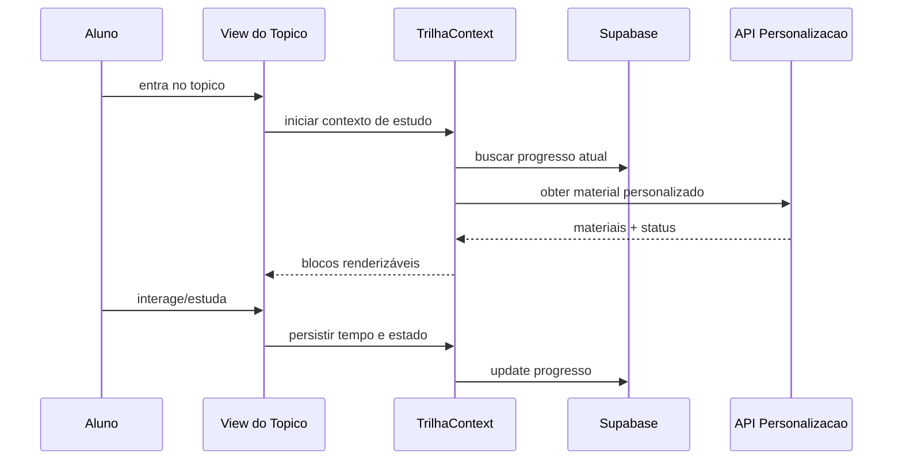

# Funcionamento Detalhado - Personalização, Gamificação e Recursos Pedagógicos (Mobile)

## 1. Objetivo
Descrever com granularidade como o app aplica personalização e gamificação no fluxo real de estudo.

## 2. Personalização
### 2.1 Entrada funcional
- perfil BrainHex do aluno
- material personalizado do tópico
- progresso histórico local/persistido

### 2.2 Fluxo
1. abrir tópico
2. resolver se há material personalizado válido
3. montar sequência de blocos
4. renderizar conforme tipo
5. persistir progresso incremental

### 2.3 Motivos
- aderência de linguagem e estética
- redução de carga cognitiva
- maior foco no objetivo pedagógico

### 2.4 Objetivos
- aumentar conclusão de tópicos
- elevar retenção de conteúdo
- melhorar acurácia em atividade

## 3. Gamificação
### 3.1 Componentes visíveis
- ranking
- conquistas
- notificações
- métricas de progresso

### 3.2 Dependências técnicas
- eventos válidos em `eventos_aluno`
- atualização de progresso em tabelas de aluno
- leitura por view de ranking consolidada

### 3.3 Motivos
- feedback imediato
- motivação extrínseca com progresso comparável

### 3.4 Objetivos
- elevar tempo ativo em tópicos
- aumentar frequência de estudo
- reduzir desistência no meio do módulo

## 4. Recursos pedagógicos
### 4.1 Recursos aplicados
- texto estruturado (markdown)
- áudio guiado
- apresentação visual
- prática por atividade
- revisão por cards

### 4.2 Estratégia multimodal
- combinar teoria + explicação + prática + revisão
- manter fallback por formato

### 4.3 Motivos
- contemplar estilos de aprendizagem diversos
- reforçar memória de curto e médio prazo

### 4.4 Objetivos
- melhorar transferência do conteúdo para resolução
- aumentar autonomia no estudo

## 5. Regras críticas de consistência
- tempo só deve contar quando o estudo estiver ativo no tópico
- atividade concluída deve atualizar progresso e eventos
- falha de mídia não pode bloquear avanço pedagógico

## 6. Fluxo detalhado (sequência)

## 7. Indicadores recomendados
- tempo ativo por tópico
- conclusão por tópico
- acertos por atividade
- taxa de uso de material personalizado
- evolução de posição no ranking
