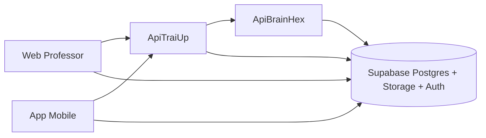

# 01. Visao geral do projeto

Data de atualizacao: 2026-04-19

## 1. Proposito do ecossistema TrailUp
O TrailUp e um ecossistema educacional adaptativo orientado a perfil motivacional (BrainHex), progressao pedagogica por trilha e instrumentos de gamificacao mediveis. O objetivo operacional e aumentar engajamento, continuidade de estudo e desempenho academico sem abrir mao de governanca tecnica e pedagogica.

## 2. Problema que o projeto enfrenta
Em ambientes de ensino com conteudo uniforme e baixa personalizacao, observam-se:
- desengajamento progressivo apos os primeiros modulos;
- alta variabilidade de ritmo e forma de aprendizado;
- baixa rastreabilidade do que efetivamente gera progresso;
- dificuldade de tomada de decisao por docentes sem dados comparaveis.

## 3. Objetivos de negocio e produto
- elevar taxa de conclusao de topicos e classes;
- reduzir abandono em ciclos de estudo;
- melhorar taxa de acerto em atividades e qualidade da argumentacao em itens abertos;
- oferecer ao professor uma camada de observabilidade e acao (planejar, intervir, acompanhar impacto).

## 4. Objetivos tecnicos
- manter contratos estaveis entre app, web e APIs;
- garantir idempotencia e resiliencia em jobs assincronos;
- suportar personalizacao multimidia com rastreabilidade por aluno/turma/topico/ciclo;
- permitir evolucao incremental sem dependencia de migracoes destrutivas frequentes.

## 5. Stakeholders
- aluno: consome trilha, executa atividades, recebe reforcos personalizados;
- professor: opera turma, acompanha ranking/progresso, aciona personalizacao;
- coordenacao: usa indicadores consolidados para governanca pedagogica;
- equipe tecnica: evolui arquitetura, dados, qualidade e observabilidade.

## 6. Visao arquitetural de contexto

## 7. Principios estruturantes
- separacao de responsabilidades: orquestracao no core, geracao multimidia no microservico;
- canonicidade de dados: material final consolidado no payload canonico do conteudo personalizado;
- auditabilidade: eventos de progresso e status de jobs com trilha de execucao;
- padronizacao de estado: pending, processing, completed, failed, partial;
- orientacao a perfil: identidade visual, narrativa e estrategia pedagogica por BrainHex.

## 8. Escopo funcional de alto nivel
- gerenciamento de classes, topicos, conteudos e atividades;
- ciclo de personalizacao por aluno/topico/conteudo;
- renderizacao e entrega de materiais (markdown, audio, apresentacao, cards, quiz);
- captura de telemetria e atualizacao de indicadores;
- ranking e gamificacao baseados em regras SQL e consumo por view.

## 9. Fora de escopo deste ciclo
- experimento randomizado formal com grupo controle;
- recomendacao curricular inter-disciplina automatica;
- personalizacao offline completa no cliente;
- explainability de modelos generativos em nivel de token.

## 10. Riscos arquiteturais acompanhados
- regressao de contratos entre clientes e API;
- indisponibilidade parcial de LLMs ou storage;
- drift de regras de pontuacao/ranking entre codigo e banco;
- aumento de custo por geracao multimidia sem dedupe efetivo.

## 11. Indicadores macro de sucesso
- tempo ativo em topicos por aluno/turma;
- percentual de conclusao e taxa de retorno;
- pontuacao por ciclo e progresso relativo;
- cobertura de personalizacao (alunos com materiais completos);
- latencia de processamento de jobs por classe.

## 12. Evidencias e origem dos insumos
Este documento utiliza como base os artefatos iniciais informados no projeto:
- `TCC 1 - Desenvolvimento (3..6).pdf`;
- `Projeto de UX - TrailUp.docx`;
- `BrainHexSurvey.ICEC.finalVersion.docx`;
- `PESQUISA DE VALIDACAO - PROJETO TRAILUP.csv`.

Observacao: os anexos de pesquisa sao de descoberta/mercado inicial e devem ser tratados como base exploratoria, nao como validacao causal final.
