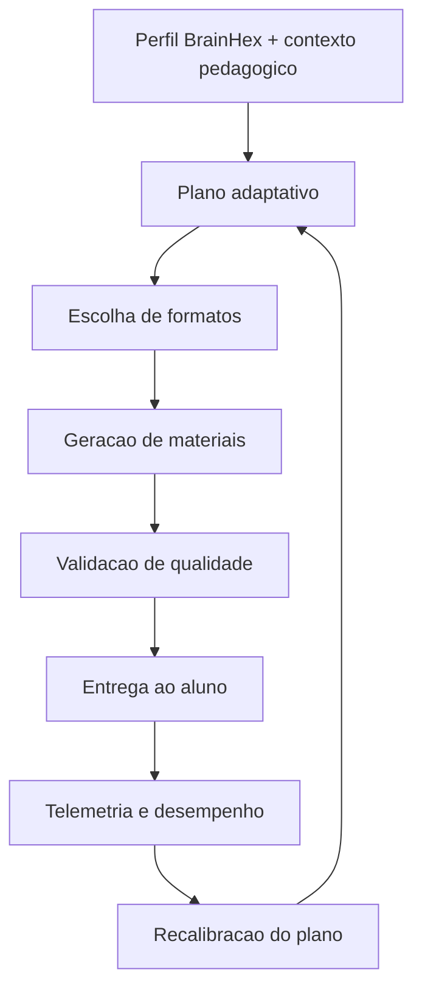

# 02. Fundamentacao teorica e modelo adaptativo

Data de atualizacao: 2026-04-19

## 1. Base conceitual
O modelo adaptativo combina quatro eixos:
- motivacao e preferencia de experiencia (BrainHex);
- instrucao ativa com feedback curto e frequente;
- gamificacao como mecanismo de progressao visivel;
- instrumentacao de dados para ajuste continuo.

## 2. BrainHex como eixo de personalizacao
Perfis considerados:
- seeker;
- survivor;
- daredevil;
- mastermind;
- conqueror;
- socializer;
- achiever.

Cada perfil influencia:
- tom da comunicacao;
- tipo de framing narrativo;
- estetica e identidade visual;
- formato pedagogico dominante (ex.: cards curtos vs explicacao analitica).

## 3. Hipoteses de aprendizagem operacionais
- H1: alinhamento de estilo comunicacional ao perfil aumenta permanencia no conteudo;
- H2: microfeedback e checkpoints melhoram conclusao de topicos;
- H3: combinacao de conteudo principal + reforco (cards/quiz) melhora retencao;
- H4: telemetria de uso permite calibracao incremental sem reescrever arquitetura.

## 4. Modelo adaptativo aplicado
Entradas:
- dados de contexto da classe/topico/conteudo;
- sinais de progresso e uso;
- perfil BrainHex dominante e distribuicao secundaria.

Processamento:
- selecao de plano pedagogico e formatos;
- geracao/adaptacao de materiais;
- validacao de qualidade e status por artefato.

Saidas:
- materiais personalizados publicados;
- metadados de execucao;
- indicadores para ranking e acompanhamento docente.

## 5. Relacao teoria -> implementacao
- teoria motivacional -> parametros de estilo e narrativa;
- teoria de reforco -> quizzes, cards e loops de revisao;
- teoria de carga cognitiva -> chunking e segmentacao de midia;
- avaliacao formativa -> progresso por item e feedback orientado.

## 6. Mapa de decisao adaptativa

## 7. Criterios de qualidade pedagogica
- fidelidade ao conteudo base da disciplina;
- clareza e progressao logica;
- adequacao ao perfil e ao nivel;
- equilibrio entre explicacao e pratica;
- ausencia de contradicoes internas entre formatos.

## 8. Criterios de qualidade tecnica
- schema valido de payload;
- links e storage_path consistentes;
- status coerente por artefato;
- idempotencia em reprocessamento;
- fallback seguro em indisponibilidade de servicos externos.

## 9. Ameacas a validade
- perfil declarado vs perfil efetivo de uso;
- vies de auto-selecao em pesquisas iniciais;
- heterogeneidade de contexto de turma;
- interferencia de fatores externos nao instrumentados.

## 10. Diretrizes para evolucao do modelo
- manter separacao entre regra de negocio e mecanismo de geracao;
- incorporar experimentos controlados por cohort;
- ampliar repertorio de sinais sem aumentar friccao de uso;
- evoluir scorecards com explicacao para docentes.
