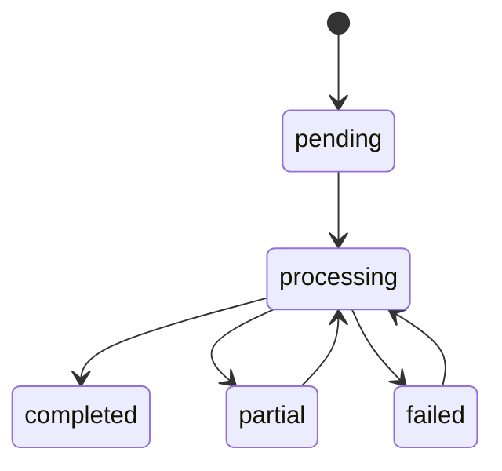
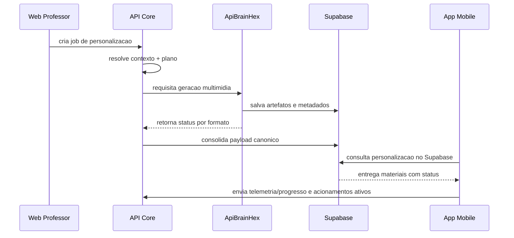

# 03. Aplicacao do modelo adaptativo

Data de atualizacao: 2026-04-19

## 1. Pipeline operacional
1. resolucao de contexto (aluno, classe, topico, conteudo);
2. leitura de perfil BrainHex e historico de progresso;
3. montagem do plano pedagogico (tom, nivel, formatos, prioridade);
4. geracao de materiais por tipo;
5. validacao de qualidade e normalizacao de status;
6. persistencia canonica e disponibilizacao aos clientes;
7. coleta de eventos de uso e fechamento de loop adaptativo.

## 2. Planejamento por perfil
Regras praticas:
- mastermind: explicacao analitica, contexto conceitual forte, progressao estruturada;
- achiever: objetivos e marcos claros, orientacao a resultado, checklist de progresso;
- seeker: abordagem exploratoria com descoberta guiada;
- survivor: foco em seguranca operacional, passo a passo e mitigacao de erro;
- conqueror: framing de conquista, metas e impacto mensuravel;
- socializer: linguagem colaborativa e exemplos conectados ao grupo;
- daredevil: dinamica de desafio, acao e superacao.

## 3. Regras de formato
- cards: reforco rapido e revisao espacada;
- quiz: validacao de consolidacao e lacunas;
- markdown/documento: explicacao principal;
- audio/apresentacao: extensoes multimidia para variacao de consumo.

## 4. Estados e transicoes

## 5. Controle de qualidade
- validacoes sintaticas de payload;
- validacoes semanticas de coerencia e aderencia;
- tratamento de `failed_quality` sem interromper entregas validas;
- preservacao de artefatos ja aprovados em reprocessamentos.

## 6. Dedupe e reuso
Quando aplicavel, a arquitetura evita trabalho repetido por meio de:
- chave de dedupe por contexto de conteudo e perfil;
- reaproveitamento de artefatos compartilhaveis;
- merge seguro no payload para nao sobrescrever saidas finalizadas.

## 7. Persistencia canonica
A fonte de verdade para consumo de materiais e o payload canonico associado ao conteudo personalizado, com metadados por formato contendo:
- status;
- qualidade;
- urls/paths de artefato;
- referencias de ciclo e contexto.

## 8. Telemetria de retorno
Sinais usados para recalibracao:
- tempo ativo em topico/conteudo;
- conclusao por item e percentual;
- acerto por atividade quando disponivel;
- engajamento em materiais personalizados.

## 9. Falhas e resiliencia
- falha de servico externo: fallback de resposta e reprocessamento posterior;
- inconsistencias de tabela opcional: operacao degrade para caminho canonico;
- falha parcial em um formato: entrega parcial sem derrubar pipeline inteiro.

## 10. Operacao docente
O professor atua em tres niveis:
- disparo de processamento (classe/aluno/topico);
- acompanhamento de estado e qualidade;
- intervencao pedagogica com base em indicadores consolidados.

## 11. Exemplo de fluxo completo

