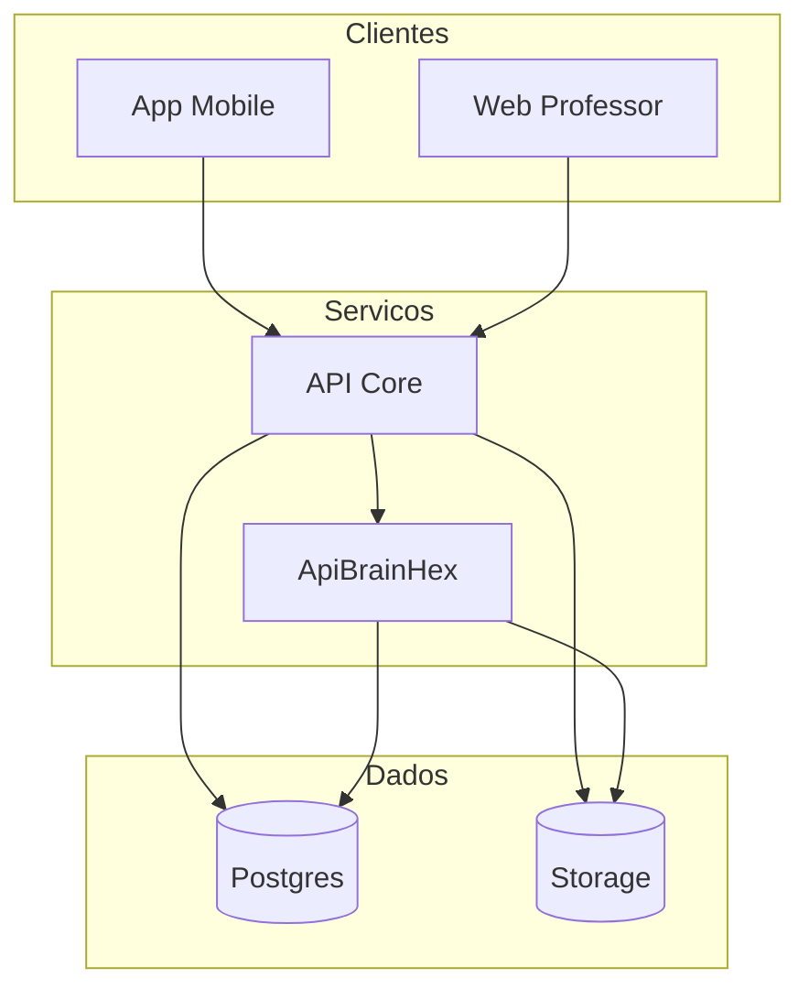
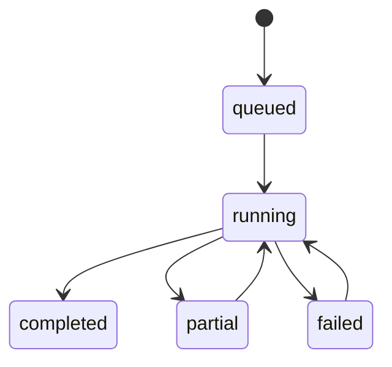

# 04. Modelagem do sistema

Data de atualizacao: 2026-04-19

## 1. Visao de contexto
O ecossistema adota arquitetura distribuida com quatro componentes principais:
- app mobile (experiencia do aluno);
- web professor (operacao academica);
- API core (orquestracao e contratos);
- microservico BrainHex (geracao multimidia especializada).

## 2. Modelo de dominio (conceitual)
Entidades centrais:
- aluno;
- classe;
- topico;
- conteudo;
- atividade;
- progresso do aluno;
- evento de aprendizagem;
- personalizacao e seus materiais;
- ranking e posicoes.

Relacoes relevantes:
- uma classe possui varios topicos;
- topico possui conteudos e atividades;
- aluno possui progresso por topico/conteudo/atividade;
- personalizacao referencia aluno + classe + topico (+ conteudo opcional);
- ranking agrega desempenho por classe/tipo de criterio.

## 3. Modelagem por camadas

## 4. Modelagem de casos de uso principais
- UC-01: consultar trilha e progresso;
- UC-02: disparar personalizacao por classe/aluno;
- UC-03: consumir materiais personalizados no app;
- UC-04: registrar eventos de progresso/tempo;
- UC-05: consolidar ranking e indicadores.

## 5. Modelo de estados dos jobs

## 6. Modelo de contrato de personalizacao
Campos estruturais esperados:
- identificadores de contexto;
- plano de personalizacao;
- materiais por formato;
- metadados por formato (status, qualidade, referencias);
- dados de rastreabilidade (ciclo, source_hash, timestamps).

## 7. Modelagem de integracao
Pontos de integracao formais:
- endpoints versionados REST;
- eventos persistidos em banco;
- storage de artefatos com prefixos previsiveis;
- view SQL para consumo de ranking por clientes.

## 8. Restricoes arquiteturais
- contratos backward-compatible em clientes ativos;
- isolamento de responsabilidade por servico;
- nao acoplamento de cliente a tabelas internas opcionais nao canonicas;
- uso de payload canonico como interface de longo prazo.

## 9. Estrategia de evolucao do modelo
- alterar contratos por versao;
- introduzir novos formatos por capability flags;
- manter migracoes reversiveis e observaveis;
- registrar decisoes arquiteturais em docs e changelog.
