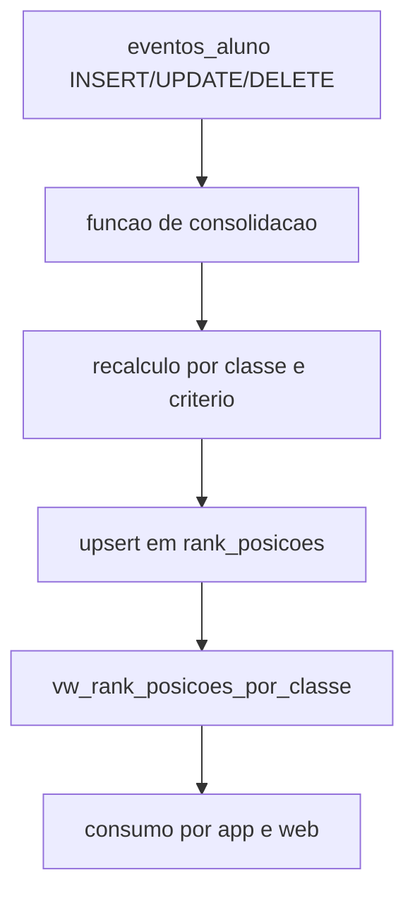

# 05. Logica e automacoes do banco

Data de atualizacao: 2026-04-19

## 1. Papel do banco no ecossistema
O banco nao atua apenas como persistencia passiva. Ele concentra regras de consolidacao de desempenho, suporte a ranking e mecanismos de integridade entre progresso, eventos e visoes de consulta.

## 2. Objetivos da camada SQL
- garantir consistencia de dados transacionais;
- reduzir logica duplicada entre clientes;
- disponibilizar visoes agregadas para consumo rapido;
- suportar operacao incremental com custo previsivel.

## 3. Estruturas principais
- tabelas de dominio academico (classes, topicos, conteudos, atividades);
- tabelas de progresso (classe_aluno, topico_aluno, conteudo_aluno, atividade_aluno);
- tabelas de eventos e gamificacao (eventos_aluno, ranks, rank_posicoes);
- tabelas de personalizacao e materiais;
- views de consolidacao para clientes.

## 4. Automacoes tipicas
- funcoes SQL utilitarias para normalizacao de referencia e resolucao de classe;
- triggers para recalculo de ranking quando eventos mudam;
- upsert de posicoes por criterio (pontuacao, tempo, percentual);
- notificacoes de conquista/ranking condicionadas a mudanca de estado.

## 5. Fluxo de atualizacao de ranking

## 6. Regras de tempo ativo
Diretriz funcional:
- contabilizar tempo efetivo dentro do topico/conteudo/atividade;
- evitar inflacao por background sem interacao;
- refletir agregados em progresso e ranking de tempo.

## 7. Consistencia e idempotencia
- triggers devem ser deterministicas para o mesmo estado final;
- upsert em tabelas de rank evita duplicidade de posicao;
- funcoes de resolucao de referencia tratam formatos heterogeneos (`123`, `topico:123`).

## 8. Governanca de schema
- mudancas estruturais via migration versionada;
- scripts manuais apenas para manutencao controlada;
- evitar dependencia de tabelas opcionais nao canonicas em fluxos criticos.

## 9. Observabilidade SQL recomendada
- consultas de sanidade por classe;
- diferenca entre progresso agregado e detalhe por item;
- distribuicao de eventos por tipo e janela temporal;
- latencia de atualizacao de ranking apos evento.

## 10. Riscos e mitigacoes
- trigger complexo sem teste -> adicionar testes de regressao SQL;
- view com custo alto -> indices e materializacao seletiva;
- drift entre codigo e banco -> doc de contratos + checklist de release.
