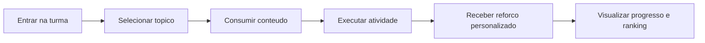

# 07. Documento de UX

Data de atualizacao: 2026-04-19

## 1. Objetivo de UX
Projetar experiencia de aprendizagem que combine clareza de objetivo, progressao visivel e adaptacao por perfil sem aumentar complexidade operacional para aluno e docente.

## 2. Personas operacionais
- aluno iniciante: precisa de orientacao clara e reforco curto;
- aluno autonomo: busca ritmo proprio e feedback objetivo;
- professor gestor: precisa de visao de turma e acoes rapidas;
- professor analitico: exige indicadores confiaveis e comparaveis.

## 3. Jornada macro do aluno

## 4. Principios de interface
- reduzir ambiguidade: objetivo de cada tela explicito;
- manter continuidade: estado e progresso sempre visiveis;
- incentivar acao: proximas tarefas com CTA claro;
- feedback imediato: sucesso, erro e pendencia com linguagem simples.

## 5. Adaptacao visual por BrainHex
Elementos adaptaveis:
- paleta de cor;
- simbolismo visual;
- nomenclatura de guia;
- entonacao de mensagens e reforcos.

## 6. Conteudo e leitura multimidia
Diretrizes:
- markdown deve parecer conteudo nativo do app;
- pdf/docx/pptx com visualizador padronizado e controles consistentes;
- videos (arquivo e embed) com fallback e indicacao de estado;
- evitar renderizacao fragmentada de textos de apresentacao.

## 7. Acessibilidade e inclusao
- contraste minimo adequado;
- tamanho de fonte legivel;
- foco navegavel por teclado (web);
- mensagens de erro compreensiveis;
- componentes semanticamente corretos.

## 8. UX operacional do professor
- disparo de job com escopo definido (classe/aluno/topico);
- feedback de status por etapa;
- visao de gargalos (pendente, parcial, falha);
- atalho para intervencao pedagogica por grupo de alunos.

## 9. Telemetria de UX
Eventos prioritarios:
- abertura/fechamento de topico;
- tempo ativo por sessao;
- conclusao de atividade;
- interacao com material personalizado;
- abandono de fluxo antes de conclusao.

## 10. Heuristicas de avaliacao continua
- tempo para primeira acao relevante;
- taxa de conclusao por tela critica;
- taxa de erro por acao;
- retorno semanal do aluno;
- taxa de uso das recomendacoes personalizadas.
