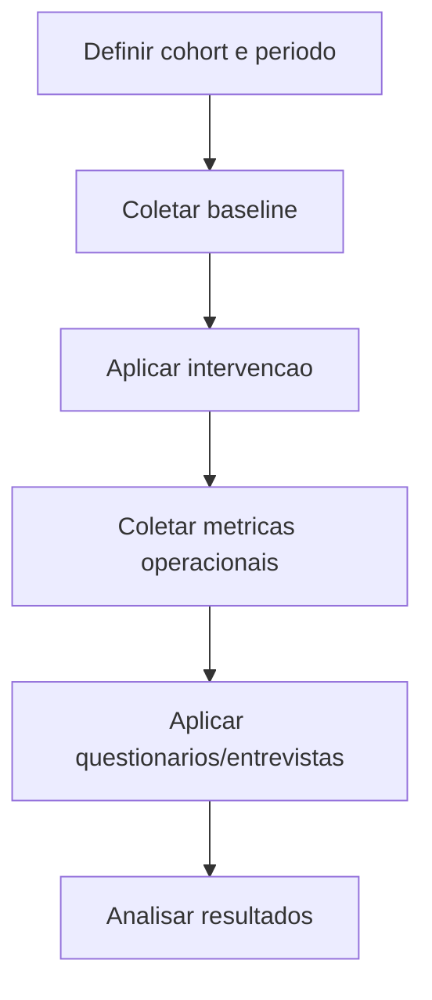

# 09. Metodologia de pesquisa e avaliacao

Data de atualizacao: 2026-04-19

## 1. Objetivo metodologico
Avaliar se a personalizacao orientada a BrainHex e a gamificacao associada melhoram indicadores de engajamento e desempenho em contexto educacional real.

## 2. Natureza das evidencias atuais
As pesquisas anexadas no projeto sao de fase inicial (descoberta e mercado). Elas orientam:
- priorizacao de funcionalidades;
- desenho de experiencia;
- hipoteses de valor.

Nao substituem protocolo experimental final.

## 3. Perguntas de pesquisa sugeridas
- PR1: a personalizacao aumenta tempo ativo por topico?
- PR2: ha ganho em conclusao e acerto por atividade?
- PR3: qual perfil BrainHex responde melhor a cada formato?
- PR4: quais elementos de UX impactam retencao semanal?

## 4. Desenho de avaliacao recomendado
Fase 1 (baseline):
- medir indicadores sem intervencoes novas.

Fase 2 (intervencao controlada):
- aplicar personalizacao por cohort;
- manter grupo comparavel quando possivel.

Fase 3 (avaliacao longitudinal):
- acompanhar estabilidade dos ganhos ao longo de ciclos.

## 5. Instrumentos
- logs de telemetria do sistema;
- dados de progresso e eventos no banco;
- questionarios de percepcao de utilidade e usabilidade;
- entrevistas semiestruturadas com docentes.

## 6. Procedimento de coleta

## 7. Controle de vieses
- padronizar janelas temporais;
- registrar alteracoes de produto durante coleta;
- segmentar por turma/disciplina;
- monitorar dados faltantes e outliers.

## 8. Etica e privacidade
- anonimizar relatorios analiticos;
- restringir acesso a dados identificaveis;
- explicitar finalidade e periodo de uso dos dados;
- seguir politicas internas de conformidade LGPD.

## 9. Analise recomendada
- estatistica descritiva por cohorte;
- comparacao pre vs pos intervencao;
- analise segmentada por perfil BrainHex;
- triangulacao quantitativa + qualitativa.

## 10. Criterios de aceitacao de impacto
- melhoria estatisticamente e pedagogicamente relevante;
- manutencao do ganho por mais de um ciclo;
- satisfacao docente e discente sem aumento de carga operacional critica.
